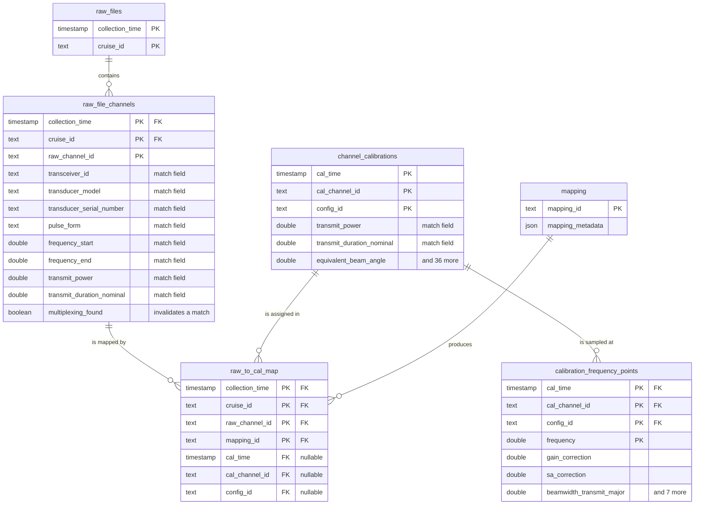

# Calibration Database Schema

Relational schema for associating raw echosounder file channels with the
calibration records that apply to them, and for storing those calibration
records. Six tables: two describe the raw side, two describe the calibration
side, one describes a mapping run, and one junction table records the
resulting associations.

The schema is the relational form of artifacts the package already produces.
`channel_mapping.yaml` (filename -> channel_id -> calibration_key) is the
junction table, and the standardized calibration files, whose stems look like
`2016-07-03__38000__config-1`, are the calibration rows.

Both sides carry the configuration fields `find_matching_calibration`
compares, so a mapping can be re-derived and audited as a SQL join rather than
only asserted. See [Matching as a join](#matching-as-a-join).

## Entity relationship diagram



The diagram abbreviates the two wide tables. Their full column lists are below.

## Tables

### raw_files

One row per raw data file. Identified by when the file was collected and the
cruise it belongs to rather than by filename, so the same file copied to a
different path or store resolves to the same row.

| Column | Type | Key | Null | Description |
| --- | --- | --- | --- | --- |
| `collection_time` | timestamp | PK | no | Start time of the file, parsed from the `D20230721-T174615` stem. UTC. |
| `cruise_id` | text | PK | no | Cruise identifier, for example `HB1603`. |

### raw_file_channels

One row per channel within a raw file. A single file carries several channels,
one per transceiver and transducer pair.

Beyond the key, the columns are the fields `find_matching_calibration`
compares. Any channel instance suffix (`_2` in `WBT 978217-15 ES38-7_2`) is
part of the channel name, so `raw_channel_id` stays unique within a file.


| Column | Type | Key | Null | Description |
| --- | --- | --- | --- | --- |
| `collection_time` | timestamp | PK, FK -> `raw_files` | no | Owning file. |
| `cruise_id` | text | PK, FK -> `raw_files` | no | Owning file. |
| `raw_channel_id` | text | PK | no | Channel name as written in the raw file, for example `WBT 400479-15 ES18_ES`. |
| `transceiver_id` | text |  | yes | Unique identifier for the transceiver unit. |
| `transducer_model` | text |  | yes | Model or type designation of the transducer. |
| `transducer_serial_number` | text |  | yes | Manufacturer serial number for the transducer. |
| `pulse_form` | text |  | yes | Type of transmitted pulse (e.g., CW, FM). |
| `frequency_start` | double precision |  | yes | Start frequency for FM pulses or nominal frequency for CW pulses. |
| `frequency_end` | double precision |  | yes | End frequency for FM pulses or nominal frequency for CW pulses. |
| `transmit_power` | double precision |  | yes | Electrical transmit power used for the ping (required for type 1 conversion equations). |
| `transmit_duration_nominal` | double precision |  | yes | Duration of the transmitted pulse prior to reception (not the effective duration). |
| `multiplexing_found` | boolean |  | yes | Indicates if multiplexing is enabled for this channel. For EK60: derived from multiple ports on same transceiver. For EK80: from Multiplexing XML attribute. |

Composite foreign key: (`collection_time`, `cruise_id`) references `raw_files`.

### channel_calibrations

One row per calibrated channel configuration, holding the calibration values
alongside the key. This is the relational form of a standardized calibration
file, whose stem is the same three parts as the primary key.

Every column below carries the standardized field of the same name, with two
renames: `cal_time` is `calibration_date` and `cal_channel_id` is `channel`.
The seven `NOT NULL` columns are the fields the standardized file schema marks
required, so a row cannot exist without the values that make it a calibration.

Values sampled against the frequency axis are not here. They are rows of
`calibration_frequency_points`.


| Column | Type | Key | Null | Description |
| --- | --- | --- | --- | --- |
| `cal_time` | timestamp | PK | no | Calibration date. The standardized `calibration_date`. |
| `cal_channel_id` | text | PK | no | Channel the calibration applies to. The standardized `channel`, for example `ES38B Serial No: 12345`. |
| `config_id` | text | PK | no | Configuration label, for example `config-1`. Assigned by position within a (calibration date, nominal frequency) group; see Open points. |
| `transmit_power` | double precision |  | no | Electrical transmit power used for the ping (required for type 1 conversion equations). |
| `transmit_duration_nominal` | double precision |  | no | Duration of the transmitted pulse prior to reception (not the effective duration). |
| `absorption_indicative` | double precision |  | no | Indicative absorption values used to calculate the time-varied gain (TVG) in the absence of detailed data. |
| `sound_speed_indicative` | double precision |  | no | Mean sound speed in water used to calculate echo range when detailed profiles are unavailable. |
| `sample_interval` | double precision |  | no | Time between individual samples along a beam (common for all beams in a ping). |
| `transmit_bandwidth` | double precision |  | no | Estimated bandwidth of the transmitted pulse. |
| `equivalent_beam_angle` | double precision |  | no | Equivalent beam angle of the receive beam. |
| `record_created` | timestamp |  | yes | ISO8601 timestamp indicating when this calibration record was created in the system. Auto-populated when derived from raw files or manufacturer calibration files; can be manually filled for user-created records. |
| `record_author` | text |  | yes | Name or identifier of the individual who generated this calibration record. |
| `source_filenames` | json |  | yes | List of calibration source files that produced this channel's parameters. |
| `source_file_paths` | json |  | yes | Absolute or relative paths to the calibration source files for this channel. |
| `source_file_type` | text |  | yes | File extension or descriptor describing the calibration source files linked to this channel. |
| `source_file_location` | text |  | yes | Human-readable location of the calibration source files that contributed to this channel. |
| `transceiver_id` | text |  | yes | Unique identifier for the transceiver unit. |
| `transceiver_model` | text |  | yes | Model or type designation of the transceiver. |
| `transceiver_ethernet_address` | text |  | yes | Network MAC address or Ethernet identifier for the transceiver. |
| `transceiver_serial_number` | text |  | yes | Manufacturer serial number for the transceiver unit. |
| `transceiver_number` | integer |  | yes | Numeric identifier or channel number for the transceiver. |
| `transceiver_port` | integer |  | yes | Hardware port/channel on the transceiver. For EK60: from channel ID pattern (e.g., '3-1' -> port 1). For EK80: from HWChannelConfiguration attribute. |
| `channel_instance_number` | integer |  | yes | Software channel instance number. For EK80: extracted from ChannelID suffix (e.g., '_2'). For EK60: always 1. |
| `transducer_model` | text |  | yes | Model or type designation of the transducer. |
| `transducer_serial_number` | text |  | yes | Manufacturer serial number for the transducer. |
| `pulse_form` | text |  | yes | Type of transmitted pulse (e.g., CW, FM). |
| `frequency_start` | double precision |  | yes | Start frequency for FM pulses or nominal frequency for CW pulses. |
| `frequency_end` | double precision |  | yes | End frequency for FM pulses or nominal frequency for CW pulses. |
| `nominal_transducer_frequency` | double precision |  | yes | Nominal CW operating frequency of the transducer in Hz. For EK60, this equals the channel frequency. For EK80 in FM mode, this provides the transducer's native CW operating frequency (e.g., 38000 Hz for an ES38-7 transducer) which is not otherwise directly available from the broadband frequency array. |
| `multiplexing_found` | boolean |  | yes | Indicates if multiplexing is enabled for this channel. For EK60: derived from multiple ports on same transceiver. For EK80: from Multiplexing XML attribute. |
| `calibration_comments` | text |  | yes | Narrative notes captured during the calibration event. |
| `calibration_version` | text |  | yes | Software or procedure version used when producing these calibration parameters. *add specifics |
| `calibration_acquisition_method` | text |  | yes | Brief description of the calibration workflow or platform used. |
| `beam_type` | text |  | yes | Describes the physical beam type of the transducer (e.g., split-beam, single). |
| `sphere_diameter` | double precision |  | yes | Diameter of the calibration sphere. |
| `sphere_material` | text |  | yes | Material of the calibration sphere. |
| `temperature` | double precision |  | yes | Ambient water temperature recorded during calibration. |
| `salinity` | double precision |  | yes | Water salinity during calibration. |
| `acidity` | double precision |  | yes | Water pH (acidity) during calibration, used to calculate absorption. Typical ocean values range from 7.5 to 8.5. |
| `pressure` | double precision |  | yes | Water pressure during calibration, used to calculate sound speed and absorption. |
| `sonar_software_name` | text |  | yes | Name of the sonar control or acquisition software. |
| `sonar_software_version` | text |  | yes | Version string of the sonar software controlling this channel. |


### calibration_frequency_points

One row per frequency of a calibration, holding every value the standardized
file samples at that frequency. A CW calibration has a single row; an FM sweep
has many.

The standardized file stores `frequency` and its ten companion arrays as
parallel lists. Splitting them into rows keyed by frequency keeps them aligned
by construction, so no array can drift out of step with the axis, and makes
them queryable and interpolatable in SQL.


| Column | Type | Key | Null | Description |
| --- | --- | --- | --- | --- |
| `cal_time` | timestamp | PK, FK -> `channel_calibrations` | no | Calibration date. The standardized `calibration_date`. |
| `cal_channel_id` | text | PK, FK -> `channel_calibrations` | no | Channel the calibration applies to. The standardized `channel`, for example `ES38B Serial No: 12345`. |
| `config_id` | text | PK, FK -> `channel_calibrations` | no | Configuration label, for example `config-1`. Assigned by position within a (calibration date, nominal frequency) group; see Open points. |
| `frequency` | double precision | PK | no | The frequency this row describes, Hz. One element of the standardized `frequency` array. |
| `gain_correction` | double precision |  | yes | Gain correction set from a calibration exercise (required for type 2 conversion equations). Array format supports multiple values for broadband systems. |
| `sa_correction` | double precision |  | yes | Nautical area scattering coefficient correction derived from calibration. Array format supports multiple values for broadband systems. |
| `beamwidth_transmit_major` | double precision |  | yes | One-way beam width at half-power down in the horizontal (major) direction of the transmit beam. Array format supports multiple values for broadband systems. |
| `beamwidth_receive_major` | double precision |  | yes | One-way beam width at half-power down in the horizontal (major) direction of the receive beam. Array format supports multiple values for broadband systems. |
| `beamwidth_transmit_minor` | double precision |  | yes | One-way beam width at half-power down in the vertical (minor) direction of the transmit beam. Array format supports multiple values for broadband systems. |
| `beamwidth_receive_minor` | double precision |  | yes | One-way beam width at half-power down in the vertical (minor) direction of the receive beam. Array format supports multiple values for broadband systems. |
| `echoangle_major` | double precision |  | yes | Electrical phase-derived arrival angle relative to the major beam coordinate. Array format supports multiple values for broadband systems. |
| `echoangle_minor` | double precision |  | yes | Electrical phase-derived arrival angle relative to the minor beam coordinate. Array format supports multiple values for broadband systems. |
| `echoangle_major_sensitivity` | double precision |  | yes | Scaling factor converting electrical phase differences to physical echo arrival angles (major axis). Array format supports multiple values for broadband systems. |
| `echoangle_minor_sensitivity` | double precision |  | yes | Scaling factor converting electrical phase differences to physical echo arrival angles (minor axis). Array format supports multiple values for broadband systems. |


Composite foreign key: (`cal_time`, `cal_channel_id`, `config_id`) references
`channel_calibrations`, cascading on delete.

### mapping

One row per mapping run. A run is one execution of the matching algorithm over
a set of raw files and a set of calibration records, so the tolerances and
settings that produced a set of associations stay attached to them.

| Column | Type | Key | Null | Description |
| --- | --- | --- | --- | --- |
| `mapping_id` | text | PK | no | Identifier for the mapping run. |
| `mapping_metadata` | json | | yes | Run metadata: algorithm version, field tolerances, who ran it, when, and the counts reported in the mapping summary. Held as one document column until the individual fields are settled. |

### raw_to_cal_map

Junction table. One row per raw file channel per mapping run, recording the
calibration that run assigned to that channel.

| Column | Type | Key | Null | Description |
| --- | --- | --- | --- | --- |
| `collection_time` | timestamp | PK, FK -> `raw_file_channels` | no | Raw channel being mapped. |
| `cruise_id` | text | PK, FK -> `raw_file_channels` | no | Raw channel being mapped. |
| `raw_channel_id` | text | PK, FK -> `raw_file_channels` | no | Raw channel being mapped. |
| `mapping_id` | text | PK, FK -> `mapping` | no | Mapping run that produced the row. |
| `cal_time` | timestamp | FK -> `channel_calibrations` | yes | Assigned calibration. |
| `cal_channel_id` | text | FK -> `channel_calibrations` | yes | Assigned calibration. |
| `config_id` | text | FK -> `channel_calibrations` | yes | Assigned calibration. |

Composite foreign keys: (`collection_time`, `cruise_id`, `raw_channel_id`)
references `raw_file_channels`, and (`cal_time`, `cal_channel_id`, `config_id`)
references `channel_calibrations`.

Because `mapping_id` is part of the primary key, a raw channel can be mapped
once per run, and successive runs accumulate rather than overwrite.

The three calibration columns are nullable as a group. All three null records
an unmatched channel: the run considered the channel and found no calibration.
A row absent altogether means the run did not consider the channel.

## Cardinality

| Parent | Child | Relationship |
| --- | --- | --- |
| `raw_files` | `raw_file_channels` | One to many. A file has one row per channel it carries. |
| `raw_file_channels` | `raw_to_cal_map` | One to many. A channel has one row per mapping run that covered it. |
| `channel_calibrations` | `raw_to_cal_map` | One to many. A calibration can be assigned to many raw channels, across files and runs. |
| `channel_calibrations` | `calibration_frequency_points` | One to many. One row per frequency the calibration was sampled at. |
| `mapping` | `raw_to_cal_map` | One to many. A run produces one row per raw channel it covered. |

A raw channel and a calibration therefore stand in a many to many
relationship, resolved by `raw_to_cal_map` and qualified by the run that
asserted it.

## Matching as a join

Because both sides carry the comparison fields, the seven-step comparison in
`find_matching_calibration` is expressible in SQL. The tolerances below are
`DEFAULT_TOLERANCES`; a run that used different ones records them in
`mapping.mapping_metadata`.

```sql
SELECT c.cal_time, c.cal_channel_id, c.config_id
FROM raw_file_channels r
JOIN channel_calibrations c
  ON  r.transceiver_id           =  c.transceiver_id
  AND r.transducer_model         =  c.transducer_model
  AND r.transducer_serial_number =  c.transducer_serial_number
  AND r.pulse_form               =  c.pulse_form
  AND r.frequency_start         >=  c.frequency_start - 1.0
  AND r.frequency_end           <=  c.frequency_end   + 1.0
  AND abs(r.transmit_power - c.transmit_power) <= 1.0
  AND abs(r.transmit_duration_nominal - c.transmit_duration_nominal) <= 1e-6
WHERE r.multiplexing_found = FALSE;
```

Two departures from the algorithm, which the join cannot express on its own.
`transducer_serial_number` is skipped when either side is unset rather than
compared, and a channel matching more than one calibration is a reportable
condition rather than a match. Both need handling in the caller.

## DDL

Generated from `SCHEMA_SQL` in `schema.py`, which is the source of truth.
Written for SQLite and PostgreSQL. On SQLite, `PRAGMA foreign_keys = ON` is
required for the constraints to be enforced, timestamps are stored as ISO
8601 text, and `JSON` and `BOOLEAN` take text and integer affinity.

```sql
CREATE TABLE raw_files (
    collection_time TIMESTAMP NOT NULL,
    cruise_id       TEXT      NOT NULL,
    PRIMARY KEY (collection_time, cruise_id)
);

CREATE TABLE raw_file_channels (
    collection_time           TIMESTAMP NOT NULL,
    cruise_id                 TEXT      NOT NULL,
    raw_channel_id            TEXT      NOT NULL,
    transceiver_id            TEXT,
    transducer_model          TEXT,
    transducer_serial_number  TEXT,
    pulse_form                TEXT,
    frequency_start           DOUBLE PRECISION,
    frequency_end             DOUBLE PRECISION,
    transmit_power            DOUBLE PRECISION,
    transmit_duration_nominal DOUBLE PRECISION,
    multiplexing_found        BOOLEAN,
    PRIMARY KEY (collection_time, cruise_id, raw_channel_id),
    FOREIGN KEY (collection_time, cruise_id)
        REFERENCES raw_files (collection_time, cruise_id)
        ON DELETE CASCADE
);

CREATE TABLE channel_calibrations (
    cal_time       TIMESTAMP NOT NULL,
    cal_channel_id TEXT      NOT NULL,
    config_id      TEXT      NOT NULL,

    transmit_power            DOUBLE PRECISION NOT NULL,
    transmit_duration_nominal DOUBLE PRECISION NOT NULL,
    absorption_indicative     DOUBLE PRECISION NOT NULL,
    sound_speed_indicative    DOUBLE PRECISION NOT NULL,
    sample_interval           DOUBLE PRECISION NOT NULL,
    transmit_bandwidth        DOUBLE PRECISION NOT NULL,
    equivalent_beam_angle     DOUBLE PRECISION NOT NULL,

    record_created       TIMESTAMP,
    record_author        TEXT,
    source_filenames     JSON,
    source_file_paths    JSON,
    source_file_type     TEXT,
    source_file_location TEXT,

    transceiver_id               TEXT,
    transceiver_model            TEXT,
    transceiver_ethernet_address TEXT,
    transceiver_serial_number    TEXT,
    transceiver_number           INTEGER,
    transceiver_port             INTEGER,
    channel_instance_number      INTEGER,
    transducer_model             TEXT,
    transducer_serial_number     TEXT,

    pulse_form                   TEXT,
    frequency_start              DOUBLE PRECISION,
    frequency_end                DOUBLE PRECISION,
    nominal_transducer_frequency DOUBLE PRECISION,
    multiplexing_found           BOOLEAN,

    calibration_comments           TEXT,
    calibration_version            TEXT,
    calibration_acquisition_method TEXT,
    beam_type                      TEXT,
    sphere_diameter                DOUBLE PRECISION,
    sphere_material                TEXT,

    temperature DOUBLE PRECISION,
    salinity    DOUBLE PRECISION,
    acidity     DOUBLE PRECISION,
    pressure    DOUBLE PRECISION,

    sonar_software_name    TEXT,
    sonar_software_version TEXT,

    PRIMARY KEY (cal_time, cal_channel_id, config_id)
);

CREATE TABLE calibration_frequency_points (
    cal_time       TIMESTAMP        NOT NULL,
    cal_channel_id TEXT             NOT NULL,
    config_id      TEXT             NOT NULL,
    frequency      DOUBLE PRECISION NOT NULL,

    gain_correction DOUBLE PRECISION,
    sa_correction   DOUBLE PRECISION,

    beamwidth_transmit_major DOUBLE PRECISION,
    beamwidth_receive_major  DOUBLE PRECISION,
    beamwidth_transmit_minor DOUBLE PRECISION,
    beamwidth_receive_minor  DOUBLE PRECISION,

    echoangle_major             DOUBLE PRECISION,
    echoangle_minor             DOUBLE PRECISION,
    echoangle_major_sensitivity DOUBLE PRECISION,
    echoangle_minor_sensitivity DOUBLE PRECISION,

    PRIMARY KEY (cal_time, cal_channel_id, config_id, frequency),
    FOREIGN KEY (cal_time, cal_channel_id, config_id)
        REFERENCES channel_calibrations (cal_time, cal_channel_id, config_id)
        ON DELETE CASCADE
);

CREATE TABLE mapping (
    mapping_id       TEXT NOT NULL,
    mapping_metadata JSON,
    PRIMARY KEY (mapping_id)
);

CREATE TABLE raw_to_cal_map (
    collection_time TIMESTAMP NOT NULL,
    cruise_id       TEXT      NOT NULL,
    raw_channel_id  TEXT      NOT NULL,
    mapping_id      TEXT      NOT NULL,
    cal_time        TIMESTAMP,
    cal_channel_id  TEXT,
    config_id       TEXT,
    PRIMARY KEY (collection_time, cruise_id, raw_channel_id, mapping_id),
    FOREIGN KEY (collection_time, cruise_id, raw_channel_id)
        REFERENCES raw_file_channels
            (collection_time, cruise_id, raw_channel_id)
        ON DELETE CASCADE,
    FOREIGN KEY (cal_time, cal_channel_id, config_id)
        REFERENCES channel_calibrations
            (cal_time, cal_channel_id, config_id),
    FOREIGN KEY (mapping_id)
        REFERENCES mapping (mapping_id)
        ON DELETE CASCADE,
    CHECK (
        (cal_time IS NULL AND cal_channel_id IS NULL AND config_id IS NULL)
        OR (cal_time IS NOT NULL AND cal_channel_id IS NOT NULL
            AND config_id IS NOT NULL)
    )
);

CREATE INDEX raw_to_cal_map_calibration_idx
    ON raw_to_cal_map (cal_time, cal_channel_id, config_id);

CREATE INDEX raw_to_cal_map_mapping_idx
    ON raw_to_cal_map (mapping_id);

CREATE INDEX raw_file_channels_match_idx
    ON raw_file_channels (transceiver_id, transducer_model, pulse_form);

CREATE INDEX channel_calibrations_match_idx
    ON channel_calibrations (transceiver_id, transducer_model, pulse_form);
```

## Open points

The source diagram fixes the tables, columns, and keys but not the column
types, so the types above are inferred from the values the package already
writes. Four points remain open:

- `config_id` is assigned by position, not derived from the configuration it
  names. `build_short_filename_map` groups calibrations by (calibration date,
  nominal frequency) and numbers them `config-1`, `config-2` by iteration
  order. Standardizing a different subset of source files can therefore hand
  the same physical configuration a different number, which silently repoints
  every `raw_to_cal_map` row that referenced it. The stable identity is
  `build_calibration_key`: calibration date, channel, transducer serial,
  pulse form, pulse duration, transmit power, frequency start, frequency end.
  Those are all columns now, so a `UNIQUE` constraint over them, or a
  surrogate key, would remove the exposure.
- Because that numbering pool is shared across every channel at one frequency
  on one date, a channel with several configurations can draw
  non-consecutive numbers. `(cal_time, cal_channel_id, config_id)` is still
  unique, but `config-N` does not count configurations of its own channel.
- `cal_time` is nullable and operator-supplied in the standardized file
  schema, and `build_calibration_key` falls back to an empty string. A primary
  key column cannot be null, so ingest has to guarantee it.
- `collection_time` resolution has to be fixed at the second, matching the raw
  filename stem, for the primary key to survive a reparse.
  `parse_datetime_from_filename` returns None for a file with no `D...-T...`
  stamp, and the stamp is a name heuristic that `raw_file_times` exists to
  correct, so which of the two this column holds needs settling. The value is
  naive; it should be UTC always or the column should be `TIMESTAMPTZ`.

Two further points are inherited rather than chosen, and are worth deciding
deliberately:

- Matching is purely configurational. `find_matching_calibration` has no date
  step, so a 2016 file will match a 2023 calibration if the configuration is
  identical. If the intent is the calibration in effect when the file was
  collected, `channel_calibrations` needs a validity interval.
- An ambiguous match cannot be stored. The algorithm reports
  `MultipleMatchChannel` with a count and the competing keys, but the junction
  primary key admits one row per channel per run.
