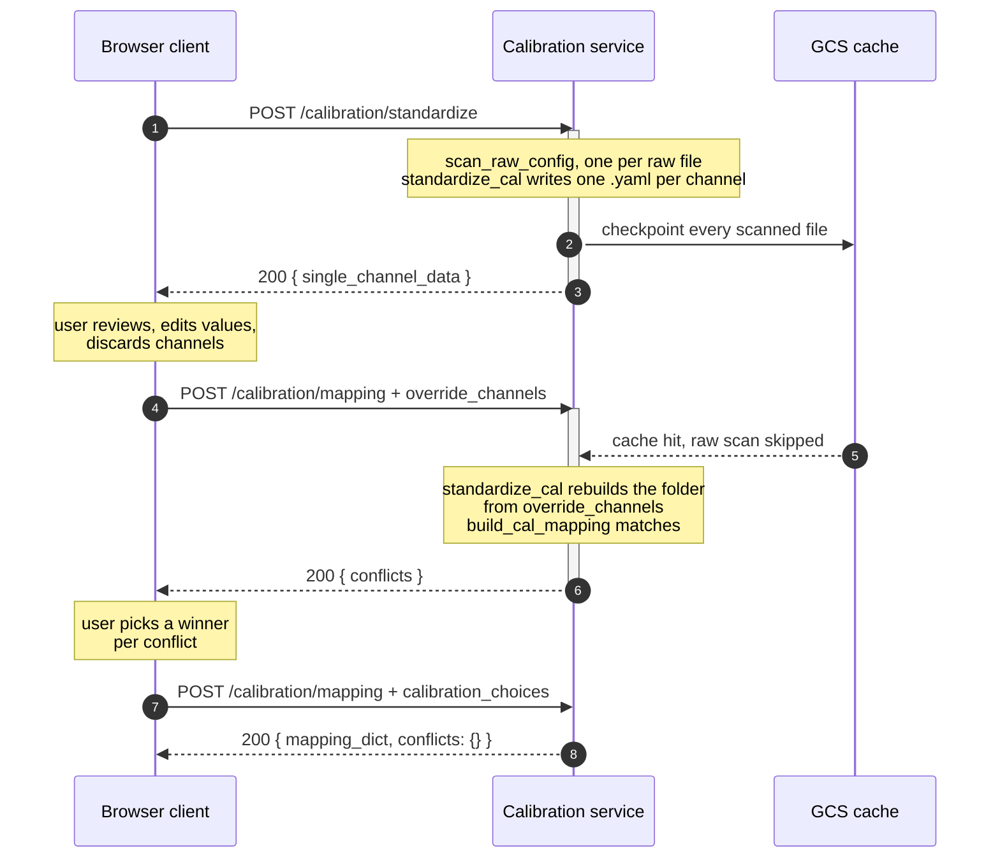

# Calibration Service API

A two-call interface for standardizing manufacturer calibration files and
mapping them onto raw echosounder channels. It is shaped so that a stateless
server and a local CLI user run the same code path: the data a browser client
edits is an ordinary recipe input, not a file only a local user can reach.

The HTTP layer described here **does not exist yet**. What is built and tested
is the recipe interface underneath it, so the endpoints below are a proposed
contract sized to what the recipes already accept and return. Every payload in
this document was generated from the running code rather than written by hand.

For how to deploy and configure the service, see
[cloud_run_deployment.md](cloud_run_deployment.md).

## Why two calls

Duplicate calibration files are only detectable at mapping time, and a person
has to choose between them: two calibrations of the same transducer on the
same day often differ only in a parameter such as transmit power. That
decision cannot be made before the run, and it cannot be made by the server.

So the pipeline splits where the human belongs. Phase 1 parses the
manufacturer `.cal` / `.xml` files into one standardized record per channel and
returns them for review. Phase 2 matches raw file channels against those
records and reports any ambiguity instead of guessing.

Between the two, the user edits values, corrects dates, and discards channels.
The edited set comes back as an input to phase 2, which rewrites the
calibration folder from it before mapping. That is what makes the pipeline work
in a container that starts with an empty disk, and it is why the archived files
always match what was actually mapped.

## End to end



Both calls are synchronous: one HTTP request runs one recipe through
`api.execute` and returns its outputs.

Phase 1 is the long one, and it is bounded by a hard 60 minute request ceiling
on Cloud Run. What makes that acceptable is that `scan_raw_config` checkpoints
every file it reads, content-addressed by that file's path. A request that
times out has still banked everything it scanned, so calling the same endpoint
again resumes rather than starting over. Treat a timeout as "call it again",
not as a failure, and keep the time window narrow enough that the first call
finishes. See [cloud_run_deployment.md](cloud_run_deployment.md) for the
sizing.

The cache hit in the middle is the point of the split. RL2307 is 5,763 raw
files across 5.54 TiB, and scanning them is the entire cost of the pipeline.
Phase 2 reuses phase 1's scan because both recipes declare those four steps
identically, and cache entries are addressed by step hash. If the two recipe
files ever drift, phase 2 silently re-reads every file; a test asserts they
match.

## POST /calibration/standardize

Parses the manufacturer calibration files and returns the standardized
channels for review. Synchronous, and the expensive call: it scans every raw
file in the window for its channel configuration.

If the request times out, call it again with the same body. Every file already
scanned is checkpointed, so the second call resumes and only pays for what is
left.

### Request

| Field | Type | Required | Description |
| --- | --- | --- | --- |
| `raw_input_folder` | string | yes | Folder of `.raw` files, a local path or a `gs://` URL. Read for channel configuration only; the files are never fully downloaded. |
| `cal_input_folder` | string | yes | Folder of manufacturer calibration files: `.cal` for EK60, `.xml` for EK80. |
| `cruise_id` | string | no | Stamped into every generated file so it stays traceable to the survey. |
| `record_author` | string | no | Recorded as the author of every generated file. |
| `file_time_start` | string | no | ISO 8601. Narrows the raw file set. |
| `file_time_end` | string | no | ISO 8601. |

```json
{
  "raw_input_folder": "gs://ggn-nmfs-aa-prod-1-data/HDD/Reuben_Lasker/RL2307/EK80/data/raw",
  "cal_input_folder": "gs://ggn-nmfs-aa-prod-1-data/HDD/Reuben_Lasker/RL2307/EK80/Calibration/RESULTS",
  "cruise_id": "RL2307",
  "file_time_start": "2023-07-17T16:30:46",
  "file_time_end": "2023-07-18T19:50:19"
}
```

### Response

| Field | Type | Description |
| --- | --- | --- |
| `single_channel_data` | object | `{"channels": [...]}`, one entry per standardized channel. This is what the user reviews. See [Channel object](#channel-object). |
| `single_channel_dir` | string | Where the files were written inside the container. Useful in logs; the client cannot read it. |
| `raw_file_configs` | array | Scanned channel configuration of every raw file in the window. |

```json
{
  "single_channel_data": {
    "channels": [
      { "_calibration_file_key": "2024-11-12__18000__config-1",  "...": "..." },
      { "_calibration_file_key": "2024-11-12__38000__config-1",  "...": "..." },
      { "_calibration_file_key": "2024-11-12__70000__config-1",  "...": "..." },
      { "_calibration_file_key": "2024-11-12__120000__config-1", "...": "..." },
      { "_calibration_file_key": "2024-11-12__200000__config-1", "...": "..." }
    ]
  }
}
```

## POST /calibration/mapping

Matches each raw channel to its calibration and writes the mapping files.
Synchronous. Takes every field from `/calibration/standardize`, plus the three
below.

### Request

| Field | Type | Required | Description |
| --- | --- | --- | --- |
| `override_channels` | object | no | The reviewed channels, in the exact shape `single_channel_data` came back in. Omit an entry to discard that channel; edit values in place to correct them. Omitting the field entirely re-parses the manufacturer files. |
| `conflict_resolution` | string | no | `"report"` (default) returns conflicts and writes nothing. `"error"` raises. `"interactive"` prompts on a terminal and must never be used from a server. |
| `calibration_choices` | object | no | `{conflict_id: chosen_cal_key}` from a previous response. A partial map resolves what it covers and reports the rest. |

### Response when conflicts are outstanding

`conflicts` is non-empty and **no mapping file was written**. Present the
choices and call again.

```json
{
  "conflicts": { "conflict-5d656d295b1d": { "...": "see Conflict object" } },
  "mapping_dict": {},
  "calibration_dict": {},
  "single_channel_data": { "channels": [] }
}
```

An empty `mapping_dict` with a non-empty `conflicts` is a normal, successful
response, not a failure. Branch on `conflicts`.

`single_channel_data` is on this response too, and the client needs it: it is
the channel set the conflicts were computed against, and the only place the
full records for the candidates can be found. `calibration_dict` is empty here.
See [Comparing candidates](#comparing-candidates).

### Response when complete

```json
{
  "conflicts": {},
  "mapping_dict": {
    "2307RL_CW-D20230717-T163046.raw": {
      "WBT 987763-15 ES38-7_ES": "2023-06-27__38000__config-1"
    }
  },
  "calibration_dict": {
    "2023-06-27__38000__config-1": { "...": "the calibration values" }
  },
  "single_channel_data": { "channels": [] }
}
```

`single_channel_data` on this response is what was actually mapped, carrying
the final file keys after any edits were applied.

## Channel object

One standardized calibration record, roughly 50 fields, validated against the
standardized calibration JSON schema. Only `channel` and `frequency` are
required; every other field may be `null`. Abridged from a real generated file:

```json
{
  "_calibration_file_key": "2024-11-12__120000__config-1",
  "channel": "ES120-7C Serial No: 0",
  "frequency": [120000.0],
  "calibration_date": "2024-11-12",
  "source_filenames": ["CalibrationDataFile-D20241112-T040149-120kHz.xml"],
  "record_created": "2026-08-13T20:27:05.864939+00:00",
  "record_author": "Brett Layman",
  "transceiver_id": "400517",
  "transceiver_model": "TransceiverTypeWBT",
  "transducer_model": "ES120-7C",
  "transducer_serial_number": null,
  "pulse_form": "0",
  "frequency_start": 120000.0,
  "frequency_end": 120000.0,
  "nominal_transducer_frequency": 120000.0,
  "transmit_power": 250.0,
  "transmit_duration_nominal": 0.001024,
  "absorption_indicative": 0.038137,
  "sound_speed_indicative": 1492.36,
  "temperature": 12.0,
  "salinity": 32.0,
  "acidity": 8.0,
  "sample_interval": 4e-05,
  "beam_type": "BeamTypeSplit",
  "sphere_diameter": 38.1,
  "sphere_material": "tungsten carbide",
  "sonar_software_name": "EK80",
  "sonar_software_version": "23.6.0.0",
  "equivalent_beam_angle": -20.7,
  "gain_correction": [27.05],
  "sa_correction": [-0.1274],
  "beamwidth_transmit_major": [6.45],
  "beamwidth_receive_major": [6.45],
  "echoangle_major": [-0.05],
  "echoangle_minor": [0.07]
}
```

### Editing rules

| Rule | Behaviour | Consequence for the client |
| --- | --- | --- |
| `_calibration_file_key` | ignored on input | Filenames are re-derived from the values, so an edit can rename a file. Sending the key back does not pin the name. |
| Discarding a channel | omit the entry | The folder is cleared and rewritten from what you send, so a dropped channel leaves no orphan behind to be matched. |
| Numeric precision | rounded, not rejected | Values are rounded to the schema's decimal places before validation, so a number typed in a browser is corrected rather than refused. |
| Degree fields | nulled if out of range | Angles outside the schema's range are replaced with `null` and a warning is logged. |

## Conflict object

Everything the user needs in order to choose. The two candidates below differ
only in `transmit_power`, on the same transducer, date and frequency. That is
why the payload carries the discriminating parameters and not just a date and a
filename: date alone would show the user two identical-looking options.

```json
{
  "conflict-5d656d295b1d": {
    "candidate_keys": [
      "2023-06-27__38000__config-1",
      "2023-06-27__38000__config-2"
    ],
    "candidates": [
      {
        "cal_key": "2023-06-27__38000__config-1",
        "calibration_date": "2023-06-27",
        "source_filenames": ["CalibrationDataFile-D20230627-T181441-38kHz.xml"],
        "channel": "ES38-7 Serial No: 337",
        "transducer_model": "ES38-7",
        "transducer_serial_number": "337",
        "pulse_form": "0",
        "nominal_transducer_frequency": 38000.0,
        "transmit_power": 2000.0,
        "transmit_duration_nominal": 0.001024,
        "frequency_start": 38000.0,
        "frequency_end": 38000.0
      },
      {
        "cal_key": "2023-06-27__38000__config-2",
        "source_filenames": ["CalibrationDataFile-D20230627-T194512-38kHz.xml"],
        "transmit_power": 1000.0
      }
    ],
    "distinguishing_fields": ["sphere_diameter", "gain_correction"],
    "affected_channel_ids": ["WBT 987763-15 ES38-7_ES"],
    "affected_filenames": [
      "2307RL_CW-D20230717-T163046.raw",
      "2307RL_CW-D20230717-T165134.raw"
    ],
    "affected_channel_count": 2
  }
}
```

| Field | Type | Description |
| --- | --- | --- |
| `candidate_keys` | string[] | The calibration keys in contention. One of these is sent back as the choice. |
| `candidates` | object[] | A summary of each candidate, enough to label it in a list. Not the full record; see [Comparing candidates](#comparing-candidates). |
| `distinguishing_fields` | string[] | Names of the fields whose values actually differ between the candidates. Empty when they match everywhere it matters. |
| `affected_channel_ids` | string[] | The raw channel ids that matched more than one calibration. |
| `affected_filenames` | string[] | Which raw files are held up by this conflict. |
| `affected_channel_count` | number | How many raw file channels this single decision settles. |

The conflict id is `conflict-` followed by the first 12 hex characters of a
SHA-256 over the sorted candidate keys. It is stable across processes and
machines, so the id a client receives is always the id it can send back.

### Comparing candidates

The `candidates` summaries are enough to label a list, but often not enough to
choose from. In a real RL2307 run, three conflicts were each a 38.1 mm sphere
calibration against a 25 mm sphere calibration of the same FM channel: every
summary field was identical and only the source filename differed, while the
gain corrections differed by nearly 3 dB.

So the full comparison belongs to the client, which already has the records.
Join `candidate_keys` against `single_channel_data` on `_calibration_file_key`:

```js
const records = single_channel_data.channels.filter(
  c => conflict.candidate_keys.includes(c._calibration_file_key)
);
```

Then use `distinguishing_fields` to decide what to show. It names the fields
that genuinely differ, having already dropped the ones any two calibration
records differ in by construction: `source_filenames`, `record_created`,
`record_author`, and the source-file location fields. For the RL2307 conflicts
above it comes back as:

```json
["absorption_indicative", "beamwidth_receive_major", "beamwidth_receive_minor",
 "beamwidth_transmit_major", "beamwidth_transmit_minor", "echoangle_major",
 "echoangle_minor", "frequency", "gain_correction", "sa_correction",
 "sphere_diameter"]
```

`sphere_diameter` is the one a person decides on; the rest are the measured
consequences. Note that `gain_correction` and the beamwidths are per-frequency
arrays on an FM channel, so they want summarizing rather than a value-by-value
diff.

**Join against the `single_channel_data` on the same response, not the one from
phase 1.** Eight fields feed the filename stem that becomes a calibration key:
`calibration_date`, `channel`, `transducer_serial_number`, `pulse_form`,
`transmit_duration_nominal`, `transmit_power`, `frequency_start` and
`frequency_end`. If the user edited any of them during review, phase 2
re-derives the stems and the phase 1 keys no longer match.

`distinguishing_fields` is empty in two cases that mean different things: the
candidates really are identical everywhere that matters, or one candidate's
record was not loaded. Fall back to showing the summaries and the source
filenames rather than telling the user nothing differs.

## Resolving conflicts

There is no separate resolution endpoint. The client re-sends the same request
with one field added.

```json
{
  "raw_input_folder": "gs://...",
  "cal_input_folder": "gs://...",
  "override_channels": { "channels": [] },
  "calibration_choices": {
    "conflict-5d656d295b1d": "2023-06-27__38000__config-1"
  }
}
```

Three rules the client must follow.

1. **Resend `override_channels` unchanged.** Phase 2 rebuilds the calibration
   folder from it before mapping. Omit it and the manufacturer files are
   re-parsed, losing the user's edits, and the conflict ids change with the
   filenames they are derived from.
2. **Accumulate choices, do not replace them.** Each call carries every
   decision made so far. A choice map that drops an earlier decision leaves
   that conflict unresolved again.
3. **Loop until `conflicts` is empty.** Partial maps are supported: send two of
   five decisions and the other three come back. Only when `conflicts` is `{}`
   has a mapping file been written.

On the server side, the winner replaces the losing keys throughout
`mapping_dict`, and each loser's file moves to `unused_calibration_files/`
rather than being deleted. A key that loses one conflict but is still a
candidate in an undecided one is left alone until that conflict is settled too.

## Errors

The recipe raises ordinary Python exceptions. The status codes below are a
suggested mapping for the wrapper, not existing behaviour.

| Condition | Suggested | Detail |
| --- | --- | --- |
| Unknown conflict id | 400 | `ValueError: Unknown conflict id(s): ...`. Usually means `override_channels` changed between calls, so the ids no longer match. The message lists the valid ids. |
| Choice not a candidate | 400 | `ValueError: '...' is not a candidate for conflict-...`. The key must be one of that conflict's `candidate_keys`. |
| Invalid channel edit | 422 | `jsonschema.ValidationError`. An edited value failed the standardized schema; the message names the field and the expected type. Surface it on the field the user touched. |
| Bad `conflict_resolution` | 400 | Only `"error"`, `"interactive"` and `"report"` are accepted. |
| No calibration files found | 404 | `FileNotFoundError` from an empty or wrong `cal_input_folder`. |
| `interactive` without a terminal | 500 | Guard against this in the wrapper. It raises before moving any file, but a server should never send it. |

## Local equivalence

None of this is web-only. A local user runs the same two recipes and works
with the calibration folder directly.

```bash
aa-recipe run calibration_standardize.yaml
# review and edit outputs/calibration/single_channel_calibration_files/

aa-recipe run calibration_mapping.yaml --input conflict_resolution=error
# lists conflicts and stops; delete the unwanted file and re-run
```

Locally, `conflict_resolution=error` or `interactive` is the natural mode:
delete the unwanted file by hand, or answer a prompt. The recipe default is
`"report"` because it is written for the server, so a local run that leaves the
default gets a silent no-mapping result rather than the familiar error. Pass
the flag.

Run config is discovered per recipe as `<recipe_stem>.config.yaml`, so the two
phase recipes pick up different files by default. Keep them identical or pass
`--config` explicitly, or the two phases resolve to different cache roots and
the sharing silently does not happen.
