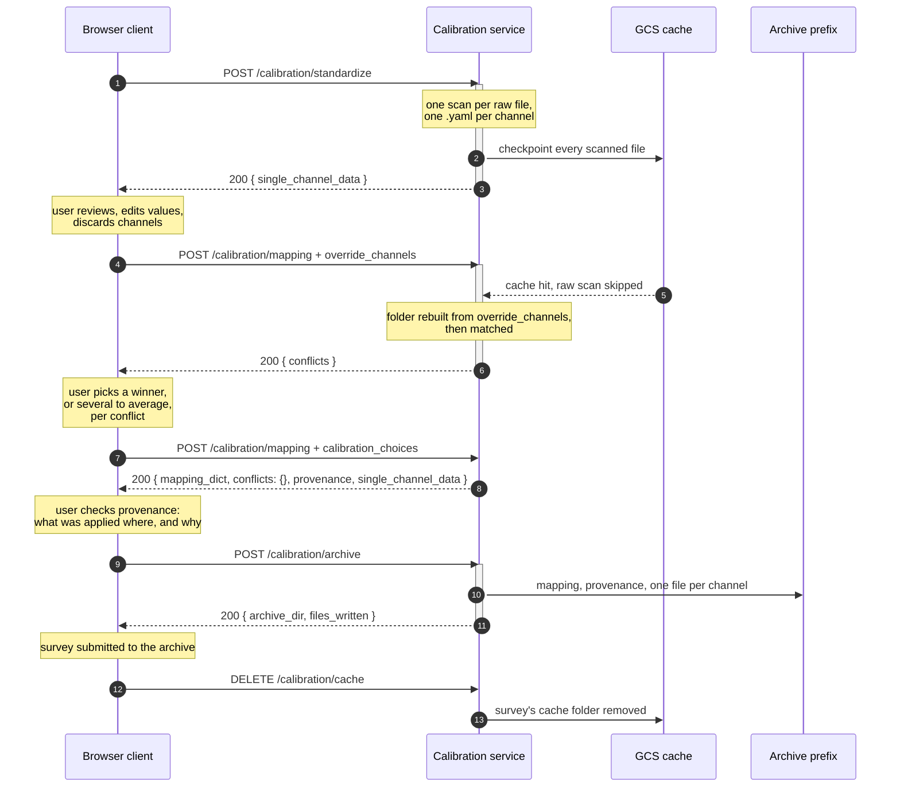

# Calibration Service API

Three calls that turn manufacturer calibration files into a mapping from raw
echosounder channels to the calibration that applies to them, and then archive
the result, plus one that clears the survey's cache afterwards.

It is shaped so that a stateless server and a local CLI user run the same code
path: the data a browser client edits is an ordinary recipe input, not a file
only a local user can reach.

The endpoints are served by the AA_SI_UI backend, under `src/backend`. Every
call requires a logged in user, and the UI reaches them as
`/api/calibration/...`. Every payload in this document was generated from the
running code rather than written by hand.

For what is left before the backend can be deployed and used from the UI, see
[backend_integration_next_steps.md](backend_integration_next_steps.md). For
sizing a Cloud Run instance, see
[cloud_run_deployment.md](cloud_run_deployment.md).

## At a glance

| Call | Recipe | What it does | Cost |
| --- | --- | --- | --- |
| `POST /calibration/standardize` | [calibration_standardize.yaml](calibration_standardize.yaml) | Parses the manufacturer files into one standardized record per channel and returns them for review. | Minutes. Scans every raw file in the window. |
| `POST /calibration/mapping` | [calibration_mapping.yaml](calibration_mapping.yaml) | Matches raw channels against the reviewed records. Reports ambiguity instead of guessing. Called again with the user's choices, each one candidate to keep or several to average, until nothing is ambiguous. | Seconds, with the scan cached. |
| `POST /calibration/archive` | [save_calibration.yaml](save_calibration.yaml) | Writes the finished calibration to the survey's archive folder. | Seconds. |
| `DELETE /calibration/cache` | none | Deletes the cached raw file scan for one survey once it is submitted. | Seconds. |

Each recipe endpoint is one recipe run through `api.execute`. The backend runs
general copies of the three recipes, kept in `src/backend/recipes/calibration/`
with no survey defaults. The copies next to this document carry RL2307
defaults for local runs, and RL2307 is the survey every example here is drawn
from.

Above the recipes, the backend does three things of its own. It picks a cache
folder and an archive folder from the [survey fields](#survey-fields), it
always resolves conflicts in report mode, and it translates failures into the
status codes under [Errors](#errors).

## Why three calls

Duplicate calibration files are only detectable at mapping time, and a person
has to choose between them, or decide to average them: two calibrations of the
same transducer on the same day often differ only in a parameter such as
transmit power, while a pre-cruise and a post-cruise calibration are often
meant to be combined. That decision cannot be made before the run, and it
cannot be made by the server.

So the pipeline splits where the human belongs. Between call 1 and call 2 the
user edits values, corrects dates, and discards channels. The edited set comes
back as an input to call 2, which rewrites the calibration folder from it before
mapping. That is what makes the pipeline work in a container that starts with an
empty disk, and it is why the archived files always match what was actually
mapped.

Call 3 exists because the first two write into a directory that does not
outlive the request. Everything the survey keeps has to be written somewhere
durable, which is the survey's archive folder.

## End to end



Every call is synchronous. Each of the first three runs one recipe through
`api.execute` and returns its outputs.

**The cache hit in the middle is the point of the split.** RL2307 is 5,763 raw
files across 5.54 TiB, and scanning them is the entire cost of the pipeline.
Call 2 reuses call 1's scan because both recipes declare those four steps
identically, and cache entries are addressed by step hash. If the two recipe
files ever drift, call 2 silently re-reads every file; a test asserts they
match.

**Treat a timeout on call 1 as "call it again".** It is bounded by a hard 60
minute request ceiling on Cloud Run, but every file it reads is checkpointed as
it goes, content-addressed by that file's path. A request that times out has
still banked everything it scanned, so the same request sent again resumes
rather than starting over. See
[cloud_run_deployment.md](cloud_run_deployment.md) for sizing.

## Survey fields

Every call carries three fields that name the survey.

| Field | Type | Description |
| --- | --- | --- |
| `ship` | string | The ship's folder name in the bucket, such as `Reuben_Lasker`. Not the display name used on the Tugboat form. |
| `cruise_id` | string | Such as `RL2307`. Also stamped into every generated calibration file. |
| `sonar_model` | string | Such as `EK80`. |

Each becomes one folder in a path, so each must be a plain folder name of
letters, digits, `.`, `_` and `-`. Spaces and slashes are rejected with 422.

They choose two folders, both under roots the deployment configures:

```
cache:    <CALIBRATION_CACHE_DIR>/<ship>/<cruise_id>/<sonar_model>
archive:  <CALIBRATION_ARCHIVE_ROOT>/<ship>/<cruise_id>/<sonar_model>/Calibration/archive
```

Send the same three values on every call for a survey. Mapping reuses the
standardize scan only when both calls resolve to the same cache folder.

## POST /calibration/standardize

Parses the manufacturer calibration files and returns the standardized channels
for review.

### Request

| Field | Type | Required | Description |
| --- | --- | --- | --- |
| `ship`, `cruise_id`, `sonar_model` | string | yes | See [Survey fields](#survey-fields). |
| `raw_input_folder` | string | yes | `gs://` folder of `.raw` files. Read for channel configuration only; the files are never fully downloaded. |
| `cal_input_folder` | string | yes | `gs://` folder of manufacturer calibration files: `.cal` for EK60, `.xml` for EK80. |
| `record_author` | string | no | Recorded as the author of every generated file. Defaults to the logged in user's name. |
| `file_time_start` | string | no | ISO 8601. Narrows the raw file set. Leave both out to use every raw file in the folder. |
| `file_time_end` | string | no | ISO 8601. |

```json
{
  "ship": "Reuben_Lasker",
  "cruise_id": "RL2307",
  "sonar_model": "EK80",
  "raw_input_folder": "gs://ggn-nmfs-aa-prod-1-data/HDD/Reuben_Lasker/RL2307/EK80/data/raw",
  "cal_input_folder": "gs://ggn-nmfs-aa-prod-1-data/HDD/Reuben_Lasker/RL2307/EK80/Calibration/RESULTS",
  "file_time_start": "2023-07-17T16:30:46",
  "file_time_end": "2023-07-18T19:50:19"
}
```

### Response

| Field | Type | Description |
| --- | --- | --- |
| `single_channel_data` | object | `{"channels": [...]}`, one entry per standardized channel. This is what the user reviews. See [Channel object](#channel-object). |
| `single_channel_dir` | string | Where the files were written inside the container. Useful in logs; the client cannot read it. |

```json
{
  "single_channel_data": {
    "channels": [
      { "_calibration_file_key": "2024-11-12__18000__config-1",  "...": "see Channel object" },
      { "_calibration_file_key": "2024-11-12__38000__config-1",  "...": "see Channel object" },
      { "_calibration_file_key": "2024-11-12__120000__config-1", "...": "see Channel object" }
    ]
  }
}
```

## POST /calibration/mapping

Matches each raw channel to its calibration. Takes every field from
`/calibration/standardize`, plus the two below.

### Request

| Field | Type | Required | Description |
| --- | --- | --- | --- |
| `override_channels` | object | no | The reviewed channels, in the exact shape `single_channel_data` came back in. Omit an entry to discard that channel; edit values in place to correct them. Omitting the field entirely re-parses the manufacturer files. |
| `calibration_choices` | object | no | `{conflict_id: chosen_cal_key}` from a previous response, or `{conflict_id: [cal_key, ...]}` to average several candidates. A partial map resolves what it covers and reports the rest. See [Averaging candidates](#averaging-candidates). |

Conflicts are always handled in report mode: the call returns them and writes
no mapping until they are resolved. The recipe's other modes raise or prompt
on a terminal, so a request that sends `conflict_resolution` is rejected.

### Response fields

Returned on both branches.

| Field | Type | Description |
| --- | --- | --- |
| `conflicts` | object | Unresolved ambiguity. Empty when a mapping was written. See [Conflict object](#conflict-object). |
| `mapping_dict` | object | `{raw filename: {channel_id: cal_key}}`. Empty while a conflict stands. |
| `calibration_dict` | object | The calibration values behind each key in the mapping. Empty while a conflict stands. |
| `single_channel_data` | object | The channel set the mapping was built from, carrying its final file keys, plus any record this call averaged. Every key in `mapping_dict` names one of these. |
| `provenance` | object | What calibration was applied over which stretch of the survey, and why, per channel. See [Provenance object](#provenance-object). |
| `provenance_path` | string | Where the same report was written as YAML inside the container. Useful in logs; the client cannot read it, and does not need to, because `provenance` is the same content. |

### When conflicts are outstanding

`conflicts` is non-empty and **no mapping file was written**. This is a normal,
successful response, not a failure. Branch on `conflicts`.

```json
{
  "conflicts": { "conflict-5d656d295b1d": { "...": "see Conflict object" } },
  "mapping_dict": {},
  "calibration_dict": {},
  "single_channel_data": { "channels": [{ "...": "see Channel object" }] },
  "provenance": { "...": "see Provenance object" },
  "provenance_path": "/tmp/8f3c.../outputs/calibration/mapping_files/calibration_provenance.yaml"
}
```

`provenance` comes back here too, with the contested channels carrying
`"status": "multiple_matches"` and the stretch of the survey each decision
covers. It is the time ranges, not the conflict payload, that tell the user how
much data a choice affects.

`single_channel_data` is on this response and the client needs it: it is the
channel set the conflicts were computed against, and the only place the full
records for the candidates can be found, because `calibration_dict` is empty
here. See [Comparing candidates](#comparing-candidates).

### When complete

```json
{
  "conflicts": {},
  "mapping_dict": {
    "2307RL_CW-D20230717-T163046.raw": {
      "WBT 987763-15 ES38-7_ES": "2023-06-27__38000__config-1"
    }
  },
  "calibration_dict": {
    "2023-06-27__38000__config-1": { "...": "the calibration values" }
  },
  "single_channel_data": { "channels": [{ "...": "see Channel object" }] },
  "provenance": { "...": "see Provenance object" },
  "provenance_path": "/tmp/8f3c.../outputs/calibration/mapping_files/calibration_provenance.yaml"
}
```

An empty `conflicts` means a mapping was written, not that every channel got a
calibration. A channel that matched nothing is not an error here, and
`mapping_dict` simply has no entry for it. `provenance` is where that shows up.

### Resolving conflicts

There is no separate resolution endpoint. The client re-sends the same request
with one field added.

```json
{
  "ship": "Reuben_Lasker",
  "cruise_id": "RL2307",
  "sonar_model": "EK80",
  "raw_input_folder": "gs://...",
  "cal_input_folder": "gs://...",
  "override_channels": { "channels": [] },
  "calibration_choices": {
    "conflict-5d656d295b1d": "2023-06-27__38000__config-1"
  }
}
```

Three rules the client must follow.

1. **Resend `override_channels` unchanged.** Call 2 rebuilds the calibration
   folder from it before mapping. Omit it and the manufacturer files are
   re-parsed, losing the user's edits, and the conflict ids change with the
   filenames they are derived from.
2. **Accumulate choices, do not replace them.** Each call carries every decision
   made so far. A choice map that drops an earlier decision leaves that conflict
   unresolved again.
3. **Loop until `conflicts` is empty.** Partial maps are supported: send two of
   five decisions and the other three come back. Only when `conflicts` is `{}`
   has a mapping been written.

On the server side, the winner replaces the losing keys throughout
`mapping_dict`, and each loser's file moves to `unused_calibration_files/`
rather than being deleted. A key that loses one conflict but is still a
candidate in an undecided one is left alone until that conflict is settled too.
So is a key that some other raw channel matched on its own: it stays that
channel's calibration.

### Averaging candidates

Answer a conflict with a list of candidate keys instead of one key, and the
server averages them. Nothing is averaged unless a list is sent.

```json
{
  "calibration_choices": {
    "conflict-91bf977e42de": [
      "2023-06-27__38000__config-1",
      "2023-08-14__38000__config-1"
    ]
  }
}
```

- **Any two or more candidates of that conflict.** Candidates left out of the
  list are losers, as with a single choice. A one-item list is the same as
  sending that key alone.
- **The average becomes a new standardized file.** Its key has the form
  `<dates>__<frequency>__average-<digest>`, for example
  `2023-06-27+2023-08-14__38000__average-91bf97`. The digest comes from the
  sorted source keys, so the same list gives the same key on every call. The
  conflict's channels are mapped to it, and the averaged candidates move to
  `unused_calibration_files/` like any other loser.
- **It comes back on `single_channel_data`.** The standardize call never sees
  an average, so the mapping response's `single_channel_data` is the only
  place its record is. Send that one to the archive call.
- **All or nothing.** Every choice in the request is checked, and every
  average computed, before anything changes. One refused average means no
  choice in that request is applied.

Every source counts equally, and a null in one source is skipped rather than
counted. Each field is combined according to what it measures:

| Rule | Fields |
| --- | --- |
| Must be the same in every source, or the request is refused | `channel`, the `transceiver_*` and `transducer_*` identifiers, `channel_instance_number`, `beam_type`, `multiplexing_found`, `pulse_form`, `frequency_start`, `frequency_end`, `nominal_transducer_frequency`, `transmit_power`, `transmit_duration_nominal`, `sample_interval`, `transmit_bandwidth`, `sphere_diameter`, `sphere_material`, `source_file_type`, and `frequency` for CW |
| Averaged as linear values (dB to linear, mean, back to dB) | `gain_correction`, `sa_correction`, `equivalent_beam_angle` |
| Averaged as they are | the four `beamwidth_*` fields, `echoangle_major`, `echoangle_minor`, both `echoangle_*_sensitivity` fields, `absorption_indicative`, `sound_speed_indicative`, `temperature`, `salinity`, `acidity`, `pressure` |
| Every source's entries, in date order | `calibration_date`, `source_filenames`, `source_file_paths` |
| Kept when the sources agree, otherwise joined with `; ` | `calibration_comments`, `calibration_version`, `calibration_acquisition_method`, `source_file_location`, `sonar_software_version`, `sonar_software_name` |
| Set new | `record_created` (now), `record_author` (the request's `record_author`), `is_averaged` (`true`) |

The must-agree fields are the hardware, the settings a gain applies to, and the
sphere it was measured with. A gain measured with any of them different is a
measurement of something else. The frequency and power fields are compared
within the matcher's default tolerances (1 Hz, 1 W, 1 µs), never a widened
one. An averaged record cannot itself be averaged again, because its sources
would be counted twice.

A null is read two ways. For the settings and the sphere (`channel`,
`pulse_form`, the frequency fields, `transmit_power`,
`transmit_duration_nominal`, `sample_interval`, `transmit_bandwidth`,
`sphere_diameter`, `sphere_material`) a null against a value is a difference,
because a gain measured at an unknown setting cannot be vouched for. Correct
it during review if the two records should agree. For the fields that
identify the hardware and the file (the `transceiver_*` and `transducer_*`
identifiers, `channel_instance_number`, `beam_type`, `multiplexing_found`,
`source_file_type`) a null means not recorded, and the average takes the
value the other sources give.

The three RL2307 conflicts described under
[Comparing candidates](#comparing-candidates), a 38.1 mm sphere calibration
against a 25 mm one, are refused. The error names the field and both values.

FM records are averaged over the union of their frequency points. Each source
is interpolated onto those points but not extrapolated, so a point only one
calibration covers carries that calibration alone. This is how pyEchoLab's
`get_calibration_from_xml` combines EK80 files. One difference: a source with
a null at one of its own points is not interpolated across it, so that point
and the gaps either side of it carry the other sources alone. Calibrations made with
different spheres are refused for FM as well, even when their bands do not
overlap, because the files do not record which parts of the band each sphere
is valid for.

An averaged record, abridged:

```json
{
  "_calibration_file_key": "2023-06-27+2023-08-14__38000__average-91bf97",
  "channel": "ES38-7 Serial No: 337",
  "calibration_date": ["2023-06-27", "2023-08-14"],
  "is_averaged": true,
  "source_filenames": [
    "CalibrationDataFile-D20230627-T181441-38kHz.xml",
    "CalibrationDataFile-D20230814-T160233-38kHz.xml"
  ],
  "record_author": "Brett Layman",
  "transmit_power": 2000.0,
  "calibration_comments": "Pre-cruise calibration; Post-cruise calibration",
  "sound_speed_indicative": 1490.4,
  "temperature": 12.6,
  "sphere_diameter": 38.1,
  "gain_correction": [27.0],
  "sa_correction": [-0.09]
}
```

Two things a client must not do:

- **Do not send the average back in `override_channels`.** Keep resending the
  original reviewed channels and the list choice. If the average and its
  sources are all sent as overrides, they match the same raw channels and the
  next call reports a three-way conflict.
- **Do not drop the list from later calls.** Rule 2 above applies: the
  average is recomputed from the choice on every call, and the same list
  yields the same key, so only `record_created` changes.

## POST /calibration/archive

Writes the finished calibration to the survey's archive folder, so it
outlives the run. Quick: a handful of small YAML files, and it reads nothing.

Everything is rendered from the data the previous calls returned, so the server
needs nothing left over from them. Send the three fields back as they came.

### Request

| Field | Type | Required | Description |
| --- | --- | --- | --- |
| `ship`, `cruise_id`, `sonar_model` | string | yes | See [Survey fields](#survey-fields). They decide the archive folder. |
| `mapping_dict` | object | yes | From the mapping response, unchanged. |
| `provenance` | object | yes | From the mapping response, unchanged. |
| `single_channel_data` | object | yes | From the mapping response, unchanged: it carries the file keys `mapping_dict` refers to. |
| `overwrite` | boolean | no | Replace an archive already in the folder. Default `false`. |

The client does not choose the destination. The backend builds it from the
survey fields and returns it as `archive_dir`, which is the value the
submission form's `calFileURI` takes.

```json
{
  "ship": "Reuben_Lasker",
  "cruise_id": "RL2307",
  "sonar_model": "EK80",
  "mapping_dict": { "...": "from the mapping response" },
  "provenance": { "...": "from the mapping response" },
  "single_channel_data": { "...": "from the mapping response" }
}
```

### Response

| Field | Type | Description |
| --- | --- | --- |
| `archive_dir` | string | The folder that was written. |
| `mapping_path` | string | Full path of the archived `channel_mapping.yaml`. |
| `provenance_path` | string | Full path of the archived `calibration_provenance.yaml`. Unlike the mapping call's field of the same name, this one points at a file that outlives the request. |
| `reports_dir` | string | The `Standardized_Reports` folder holding the channel files. |
| `channel_count` | integer | How many channel files were written. |
| `files_written` | array | Every path written, in write order. |

```json
{
  "archive_dir": "gs://.../Calibration/archive",
  "mapping_path": "gs://.../Calibration/archive/channel_mapping.yaml",
  "provenance_path": "gs://.../Calibration/archive/calibration_provenance.yaml",
  "reports_dir": "gs://.../Calibration/archive/Standardized_Reports",
  "channel_count": 10,
  "files_written": ["...", "..."]
}
```

### What the archive holds

```
<archive_dir>/
    channel_mapping.yaml
    calibration_provenance.yaml
    Standardized_Reports/
        2023-06-27__38000__config-1.yaml
        ...
```

`Standardized_Reports/` holds the same per-channel files a local run writes to
`single_channel_calibration_files/`, rendered by the same code. They are named
by each channel's file key, which is exactly what `channel_mapping.yaml` refers
to, so the archive resolves against itself years later with nothing else around.
The bytes do not depend on where the archive went: a copy written to a folder
and a copy written to a bucket are identical, so either can be checksummed
against the other.

### What it refuses

An archive that looks complete and is not is worse than a failed call, so these
are refused. Nothing is written when one fires.

- an archive folder that is not empty, unless `overwrite` is set;
- an empty `mapping_dict`, which is what the mapping call returns while
  conflicts are outstanding;
- a `mapping_dict` naming a calibration file that `single_channel_data` does not
  carry, which means the two came from different mapping runs;
- a channel whose file key is missing, shared with another channel, or not a
  plain file name. The key becomes a filename, so it is checked rather than
  trusted: a key carrying a path separator would write outside the folder,
  and two channels sharing a key would write one over the other and report both
  as archived.

## DELETE /calibration/cache

Deletes the survey's cache folder, which holds the raw file scan that lets
mapping skip it. Call it once the survey has been submitted. The archive does
not depend on the cache, but running calibration for the survey again
afterwards scans every raw file again.

### Request

The three [survey fields](#survey-fields), as query parameters.

```
DELETE /calibration/cache?ship=Reuben_Lasker&cruise_id=RL2307&sonar_model=EK80
```

### Response

| Field | Type | Description |
| --- | --- | --- |
| `cache_dir` | string | The cache folder for the survey. |
| `cleared` | boolean | `true` when something was deleted, `false` when the folder was already gone. |

Calling it twice is safe: the second call returns `"cleared": false`.

## Channel object

One standardized calibration record, roughly 50 fields, validated against the
standardized calibration JSON schema. Only `channel` and `frequency` are
required; every other field may be `null`. Abridged from a real generated file:

```json
{
  "_calibration_file_key": "2024-11-12__120000__config-1",
  "channel": "ES120-7C Serial No: 0",
  "frequency": [120000.0],
  "calibration_date": ["2024-11-12"],
  "is_averaged": false,
  "source_filenames": ["CalibrationDataFile-D20241112-T040149-120kHz.xml"],
  "record_created": "2026-08-13T20:27:05.864939+00:00",
  "record_author": "Brett Layman",
  "transceiver_id": "400517",
  "transducer_model": "ES120-7C",
  "transducer_serial_number": null,
  "pulse_form": "0",
  "frequency_start": 120000.0,
  "frequency_end": 120000.0,
  "nominal_transducer_frequency": 120000.0,
  "transmit_power": 250.0,
  "transmit_duration_nominal": 0.001024,
  "absorption_indicative": 0.038137,
  "sound_speed_indicative": 1492.36,
  "temperature": 12.0,
  "salinity": 32.0,
  "sample_interval": 4e-05,
  "beam_type": "BeamTypeSplit",
  "sphere_diameter": 38.1,
  "sphere_material": "tungsten carbide",
  "sonar_software_name": "EK80",
  "equivalent_beam_angle": -20.7,
  "gain_correction": [27.05],
  "sa_correction": [-0.1274],
  "beamwidth_transmit_major": [6.45],
  "echoangle_major": [-0.05]
}
```

### Editing rules

| Rule | Behaviour | Consequence for the client |
| --- | --- | --- |
| `_calibration_file_key` | ignored on input | Filenames are re-derived from the values, so an edit can rename a file. Sending the key back does not pin the name. |
| Discarding a channel | omit the entry | The folder is cleared and rewritten from what you send, so a dropped channel leaves no orphan behind to be matched. |
| Numeric precision | rounded, not rejected | Values are rounded to the schema's decimal places before validation, so a number typed in a browser is corrected rather than refused. |
| Degree fields | nulled if out of range | Angles outside the schema's range are replaced with `null` and a warning is logged. |
| `calibration_date` | a list of strings | One date per calibration behind the record, so one for an ordinary record. A bare string from an older client is accepted and read as a one-item list. Dates in a recognized format are rewritten as YYYY-MM-DD. |
| `is_averaged` | `true` only for an average | Set by the server when it averages candidates. A reviewed record should leave it `false`. |

## Conflict object

Everything the user needs in order to choose. The two candidates below differ
only in `transmit_power`, on the same transducer, date and frequency. That is
why the payload carries the discriminating parameters and not just a date and a
filename: date alone would show the user two identical-looking options.

```json
{
  "conflict-5d656d295b1d": {
    "candidate_keys": [
      "2023-06-27__38000__config-1",
      "2023-06-27__38000__config-2"
    ],
    "candidates": [
      {
        "cal_key": "2023-06-27__38000__config-1",
        "calibration_date": ["2023-06-27"],
        "source_filenames": ["CalibrationDataFile-D20230627-T181441-38kHz.xml"],
        "channel": "ES38-7 Serial No: 337",
        "transducer_model": "ES38-7",
        "transducer_serial_number": "337",
        "pulse_form": "0",
        "nominal_transducer_frequency": 38000.0,
        "transmit_power": 2000.0,
        "transmit_duration_nominal": 0.001024,
        "frequency_start": 38000.0,
        "frequency_end": 38000.0
      },
      {
        "cal_key": "2023-06-27__38000__config-2",
        "source_filenames": ["CalibrationDataFile-D20230627-T194512-38kHz.xml"],
        "transmit_power": 1000.0,
        "...": "the rest identical to config-1"
      }
    ],
    "distinguishing_fields": ["sphere_diameter", "gain_correction"],
    "affected_channel_ids": ["WBT 987763-15 ES38-7_ES"],
    "affected_filenames": [
      "2307RL_CW-D20230717-T163046.raw",
      "2307RL_CW-D20230717-T165134.raw"
    ],
    "affected_channel_count": 2
  }
}
```

| Field | Type | Description |
| --- | --- | --- |
| `candidate_keys` | string[] | The calibration keys in contention. One of these is sent back as the choice, or several of them as a list to average. |
| `candidates` | object[] | A summary of each candidate, enough to label it in a list. Not the full record; see [Comparing candidates](#comparing-candidates). |
| `distinguishing_fields` | string[] | Names of the fields whose values actually differ between the candidates. Empty when they match everywhere it matters. |
| `affected_channel_ids` | string[] | The raw channel ids that matched more than one calibration. |
| `affected_filenames` | string[] | Which raw files are held up by this conflict. |
| `affected_channel_count` | number | How many raw file channels this single decision settles. |

The conflict id is `conflict-` followed by the first 12 hex characters of a
SHA-256 over the sorted candidate keys. It is stable across processes and
machines, so the id a client receives is always the id it can send back.

### Comparing candidates

The `candidates` summaries are enough to label a list, but often not enough to
choose from. In a real RL2307 run, three conflicts were each a 38.1 mm sphere
calibration against a 25 mm sphere calibration of the same FM channel: every
summary field was identical and only the source filename differed, while the
gain corrections differed by nearly 3 dB.

So the full comparison belongs to the client, which already has the records.
Join `candidate_keys` against `single_channel_data` on `_calibration_file_key`:

```js
const records = single_channel_data.channels.filter(
  c => conflict.candidate_keys.includes(c._calibration_file_key)
);
```

Then use `distinguishing_fields` to decide what to show. It names the fields
that genuinely differ, having already dropped the ones any two calibration
records differ in by construction: `source_filenames`, `record_created`,
`record_author`, and the source-file location fields. For the RL2307 conflicts
above it comes back as:

```json
["absorption_indicative", "beamwidth_receive_major", "beamwidth_receive_minor",
 "beamwidth_transmit_major", "beamwidth_transmit_minor", "echoangle_major",
 "echoangle_minor", "frequency", "gain_correction", "sa_correction",
 "sphere_diameter"]
```

`sphere_diameter` is the one a person decides on; the rest are the measured
consequences. Note that `gain_correction` and the beamwidths are per-frequency
arrays on an FM channel, so they want summarizing rather than a value-by-value
diff.

**Join against the `single_channel_data` on the same response, not the one from
call 1.** Eight fields feed the filename stem that becomes a calibration key:
`calibration_date`, `channel`, `transducer_serial_number`, `pulse_form`,
`transmit_duration_nominal`, `transmit_power`, `frequency_start` and
`frequency_end`. If the user edited any of them during review, call 2 re-derives
the stems and the call 1 keys no longer match.

`distinguishing_fields` is empty in two cases that mean different things: the
candidates really are identical everywhere that matters, or one candidate's
record was not loaded. Fall back to showing the summaries and the source
filenames rather than telling the user nothing differs.

## Provenance object

The check a user runs before trusting the mapping: for every channel, what
calibration was applied over which stretch of the survey, and why. Returned on
both mapping responses under `provenance`, and archived as
`calibration_provenance.yaml`.

`mapping_dict` answers "which calibration key", one raw file at a time, and for
a cruise of several thousand files that is too much to read and still says
nothing about the channels it has no entry for. Provenance answers "was this
right", and collapses to something a person can actually check.

### Segments

Consecutive raw files whose channels behaved identically collapse into one
**segment** carrying a time range. A cruise of thousands of files reports as a
handful of segments per channel, and a segment breaks wherever the answer
changes: a different calibration, a changed sounder setting, a multiplexing
warning, or a gap where the channel was absent from a file.

```json
{
  "schema_version": "1",
  "generated": "2026-09-14T21:36:38.555063+00:00",
  "cruise_id": "RL2307",
  "summary": {
    "raw_files": 4,
    "time_start": "2023-07-17T16:30:46",
    "time_end": "2023-07-18T19:50:19",
    "channels_total": 4,
    "channels_matched": 1,
    "channels_matched_under_override": 2,
    "channels_unmatched": 1,
    "channels_multiple_matches": 0,
    "channels_multiplexed": 0,
    "calibration_files_loaded": 1,
    "calibration_files_used": 1,
    "calibration_files_averaged": 0
  },
  "tolerances": {
    "defaults":   { "transmit_power": 1.0, "...": "..." },
    "applied":    { "transmit_power": 1001.0, "...": "..." },
    "overridden": { "transmit_power": { "default": 1.0, "applied": 1001.0, "units": "W" } }
  },
  "unmatched_channel_policy": { "unmapped_channels": "warn", "effect": "..." },
  "outcomes": { "calibration_applied": "The matched calibration was applied. ..." },
  "channels": {
    "WBT 987763-15 ES38-7_ES": {
      "frequency_hz": 38000.0,
      "transducer_model": "ES38-7",
      "transceiver_id": "987763",
      "segments": [ { "...": "see below" } ]
    }
  },
  "calibration_files": {
    "2023-06-27__38000__config-1": {
      "channel": "ES38-7 Serial No: 337",
      "calibration_date": ["2023-06-27"],
      "measured_at": { "transmit_power": 1000.0, "...": "..." },
      "source_filenames": ["CalibrationDataFile-D20230627-T181441-38kHz.xml"],
      "is_averaged": false
    }
  }
}
```

A calibration file this run averaged also says what went into it. The two
spreads are the largest difference between the sources at any frequency, in
dB. They are the number to check before trusting the average. Per-source
corrections are listed for CW records only, because an FM record carries one
per frequency point.

```json
"2023-06-27+2023-08-14__38000__average-91bf97": {
  "channel": "ES38-7 Serial No: 337",
  "calibration_date": ["2023-06-27", "2023-08-14"],
  "frequency_hz": [38000.0],
  "measured_at": { "transmit_power": 2000.0, "...": "..." },
  "source_filenames": [
    "CalibrationDataFile-D20230627-T181441-38kHz.xml",
    "CalibrationDataFile-D20230814-T160233-38kHz.xml"
  ],
  "is_averaged": true,
  "gain_correction_spread_db": 0.16,
  "sa_correction_spread_db": 0.04,
  "averaged_from": [
    {
      "calibration_key": "2023-06-27__38000__config-1",
      "calibration_date": ["2023-06-27"],
      "source_filenames": ["CalibrationDataFile-D20230627-T181441-38kHz.xml"],
      "gain_correction": 26.92,
      "sa_correction": -0.07
    },
    {
      "calibration_key": "2023-08-14__38000__config-1",
      "calibration_date": ["2023-08-14"],
      "source_filenames": ["CalibrationDataFile-D20230814-T160233-38kHz.xml"],
      "gain_correction": 27.08,
      "sa_correction": -0.11
    }
  ]
}
```

Two blocks are there so a client never has to hardcode wording:
`unmatched_channel_policy.effect` spells out what actually happened to an
unmatched channel under the policy in force, and `outcomes` is a glossary of
every `outcome` token in the report, carried once rather than on every segment.

### Segment statuses

| `status` | `outcome` | What it means |
| --- | --- | --- |
| `matched` | `calibration_applied` | A calibration matched on every field, within the default tolerances. Nothing to check. |
| `matched_under_widened_tolerance` | `calibration_applied_under_override` | A calibration was applied, but only because a tolerance was widened. It was measured at a different setting than it is being applied to, so its gain and `sa_correction` carry a bias of that difference. |
| `unmatched` | `fallback_to_raw_file_values` or `run_stopped` | No calibration matched. Which outcome appears depends on the `unmapped_channels` policy of the step that consumes the mapping, echoed in `unmatched_channel_policy`. |
| `multiple_matches` | `conflict_unresolved` | Several calibrations matched. Carries `candidate_calibration_keys`; the matching entry in `conflicts` is what the user answers. |

Beyond the time range and the calibration key, a `matched` segment carries only
`raw_settings` and `calibration_settings`, because those two blocks agreeing is
the whole story. Every other status adds a `reason` sentence and the field-level
detail behind it.

An `unmatched` segment names the calibration that got closest and the field it
failed on, so the user can see it was the right transducer and only the setting
was wrong:

```json
{
  "status": "unmatched",
  "outcome": "fallback_to_raw_file_values",
  "calibration_key": null,
  "raw_files": 1,
  "time_start": "2023-07-18T04:10:22",
  "time_end": "2023-07-18T04:31:10",
  "raw_settings": { "transmit_duration_nominal": 0.000256, "...": "..." },
  "candidates_rejected_at": { "transmit_duration_nominal": 1 },
  "failed_on": "transmit_duration_nominal",
  "closest_calibration": "ES38-7 Serial No: 337",
  "comparison": {
    "transducer_model": { "raw": "ES38-7", "calibration": "ES38-7", "matched": true },
    "transmit_duration_nominal": {
      "raw": 0.000256, "calibration": 0.001024, "matched": false,
      "tolerance": 1e-06, "units": "s", "difference": 0.000768
    },
    "...": "..."
  },
  "reason": "transmit_duration_nominal differs by 0.000768 s: these files run at 0.000256 s and the closest calibration was measured at 0.001024 s, against a tolerance of 1e-06 s."
}
```

`candidates_rejected_at` counts how many calibration records fell out at each
step of the match, which separates "the right transducer at the wrong setting"
from "no record for this transducer at all".

A segment that needed a widened tolerance carries `matched_only_under_override`
naming the fields, and `override_details` with the applied tolerance beside the
default it replaced:

```json
{
  "status": "matched_under_widened_tolerance",
  "outcome": "calibration_applied_under_override",
  "calibration_key": "2023-06-27__38000__config-1",
  "raw_files": 2,
  "time_start": "2023-07-17T16:30:46",
  "time_end": "2023-07-17T17:12:22",
  "matched_only_under_override": ["transmit_power"],
  "reason": "transmit_power differs by 1000 W, which the widened tolerance of 1001 W admits and the default 1 W would not.",
  "override_details": {
    "transmit_power": {
      "raw": 2000.0, "calibration": 1000.0, "matched": true,
      "tolerance": 1001.0, "units": "W", "difference": 1000.0,
      "matched_only_under_override": true, "default_tolerance": 1.0
    }
  }
}
```

This status only arises when the deployment passes match tolerances to the
mapping step. `calibration_mapping.yaml` does not, so against that recipe
`tolerances.overridden` is `{}` and every match is exact. A survey that changed
a setting mid-cruise with no calibration for the other side of the change is the
case for wiring it through, and the report is what makes the consequence visible
afterwards.

### Checking it

The summary alone answers the question most of the time:

```js
const s = provenance.summary;
const clean = s.channels_matched === s.channels_total;
```

When it is not clean, the segments say where. Anything other than `matched` is
worth showing, and the time range is what makes it actionable, because it maps
onto the part of the survey the user actually cares about:

```js
const flagged = Object.entries(provenance.channels).flatMap(
  ([channelId, channel]) => channel.segments
    .filter(seg => seg.status !== "matched" || seg.multiplexing)
    .map(seg => ({
      channelId,
      status: seg.status,
      files: seg.raw_files,
      from: seg.time_start,
      to: seg.time_end,
      why: seg.reason || seg.multiplexing,
    }))
);
```

Two things worth surfacing rather than hiding:

- **A fallback is silent downstream.** Under `unmapped_channels: warn` the run
  succeeds and the Sv is computed from whatever the raw file recorded, which is
  what echopype would use with no calibration at all. Nothing later in the
  pipeline distinguishes that data from properly calibrated data, so this report
  is the only place it is written down.
- **The report is complete even when the run is not.** It is built at mapping
  time from the scanned channel configurations, so it covers every raw file in
  the window whether or not anything downstream has processed them yet.

`channels_multiplexed` counts channels the matcher flagged as multiplexed.
Multiplexing does not stop a match, so such a segment can still be `matched`;
what marks it is a `multiplexing` note naming the warning, and the calibration
may not be valid for those pings. It is the one flag that does not show up in
the status, which is why the filter above tests for it separately.

## Errors

A failed recipe run returns this shape. `step_id` names the recipe step that
failed, and is `null` when the failure came from outside a step.

```json
{
  "detail": {
    "message": "Unknown conflict id(s): conflict-abc. Valid id(s): none.",
    "error_type": "ValueError",
    "step_id": "build_cal_mapping"
  }
}
```

The first three rows below are not recipe failures. A 401 and a 422 use
FastAPI's own error bodies, and a 503 carries only `message`.

| Condition | Status | Detail |
| --- | --- | --- |
| Not logged in | 401 | The session cookie is missing, expired or invalid. |
| Invalid request | 422 | A required field is missing, a survey field is not a plain folder name, an input folder is not `gs://`, or the body carries a field the call does not accept, such as `conflict_resolution` or `archive_dir`. FastAPI's validation body names the field. |
| Service not configured | 503 | `CALIBRATION_CACHE_DIR` is not set, or `CALIBRATION_ARCHIVE_ROOT` for the archive call. The rest of the API is unaffected. |
| Unknown conflict id | 400 | `ValueError: Unknown conflict id(s): ...`. Usually means `override_channels` changed between calls, so the ids no longer match. The message lists the valid ids. |
| Choice not a candidate | 400 | `ValueError: '...' is not a candidate for conflict-...`. The key must be one of that conflict's `candidate_keys`. |
| Malformed choice | 400 | `ValueError: The choice for conflict-... must be a calibration key, or a list of keys to average` or `... names a calibration more than once`. |
| Candidates cannot be averaged | 400 | `ValueError: conflict-...: Cannot average these calibrations: <field> differs (<key>: <value>, ...)`, or `... the result is not a valid standardized record` when a source carries a value the schema rejects. Show it against the conflict it names; the user picks one candidate instead, or corrects the field during review if the records should agree. No choice in the request was applied. |
| Invalid channel edit | 422 | `jsonschema.ValidationError`. An edited value failed the standardized schema; the message names the field and the expected type. Surface it on the field the user touched. |
| No raw or calibration files found | 404 | `FileNotFoundError` from an empty or wrong input folder, or a time window that matches no raw file. |
| Archive directory not empty | 409 | `ValueError: ... is not empty`. Confirm with the user, then resend with `overwrite: true`. |
| Archiving an empty mapping | 409 | `ValueError: mapping_dict is empty`. Conflicts are still outstanding; there is nothing to archive yet. |
| Archive content mismatch | 400 | `ValueError: The mapping references ... not in single_channel_data`. The two fields came from different mapping runs; resend both from the same response. |
| Bad calibration file key | 400 | `ValueError: ... cannot be used as filenames` or `... appear on more than one channel`. A key must be one plain file name, unique across channels. Resend `single_channel_data` unchanged. |
| Malformed archive payload | 400 | `ValueError: single_channel_data must carry one dictionary per channel`, or the same for `mapping_dict`. The body is not in the shape the mapping call returned. |
| Anything else | 500 | An unexpected failure. The full error is in the backend log. |

Any other `ValueError` a step raises is returned as 400.

## Running it locally

None of this is web-only. A local user runs the three recipes next to this
document and works with the calibration folder directly. The survey fields and
the cache endpoint belong to the service and have no local counterpart.

```bash
aa-recipe run calibration_standardize.yaml
# review and edit outputs/calibration/single_channel_calibration_files/

aa-recipe run calibration_mapping.yaml
# prompts per conflict; or pass --input conflict_resolution=error to have it
# list them and stop, then delete the unwanted file and re-run

# what the match actually did
cat outputs/calibration/mapping_files/calibration_provenance.yaml

# optional: keep a copy somewhere else
aa-recipe run save_calibration.yaml --input archive_dir=./archive
```

Three differences from the service:

- **Conflicts are answered at the terminal.** The recipe default is
  `"interactive"`, which prompts. Enter one number to keep that file, or
  several separated by commas, such as `1,2`, to average them; a combination
  that cannot be averaged says why and asks again. `"error"` lists them and
  stops so you can delete the unwanted single-channel file by hand. Do not pass
  `"report"` locally: it is the server's mode, and it returns a no-mapping
  result without saying anything a terminal user would notice.
- **Provenance is a file, not a response field.** Same content. The mapping step
  also prints a short version to the terminal: the file it wrote, and one line
  per segment that is anything other than a clean match. A run with nothing to
  report says so in one line.
- **Archiving is optional.** The outputs folder is already a directory on your
  disk, so call 3 earns its place only when the archive belongs somewhere else.
  Run locally it takes only `archive_dir` and reads the rest out of the outputs
  folder, so none of the data the service passes around has to be assembled by
  hand. Point it at a `gs://` prefix to push a local run's result to the bucket.

**All three must resolve to the same `user_cache_dir` and `outputs_dir`.** Run
config is discovered per recipe as `<recipe_stem>.config.yaml` next to the
recipe, falling back to `./aa-recipe.config.yaml` and then
`~/.config/aa-recipe/config.yaml`. The copies here ship without per-recipe
config files, so all three fall through to the same one, which is what you
want. If you add per-recipe configs, as the RL2307 example set does, keep them
identical or pass `--config` explicitly. Diverge and the failure is quiet: the
mapping call stops reusing the scan and pays for it again, and
`save_calibration.yaml` looks for the outputs folder somewhere the other two
never wrote.
