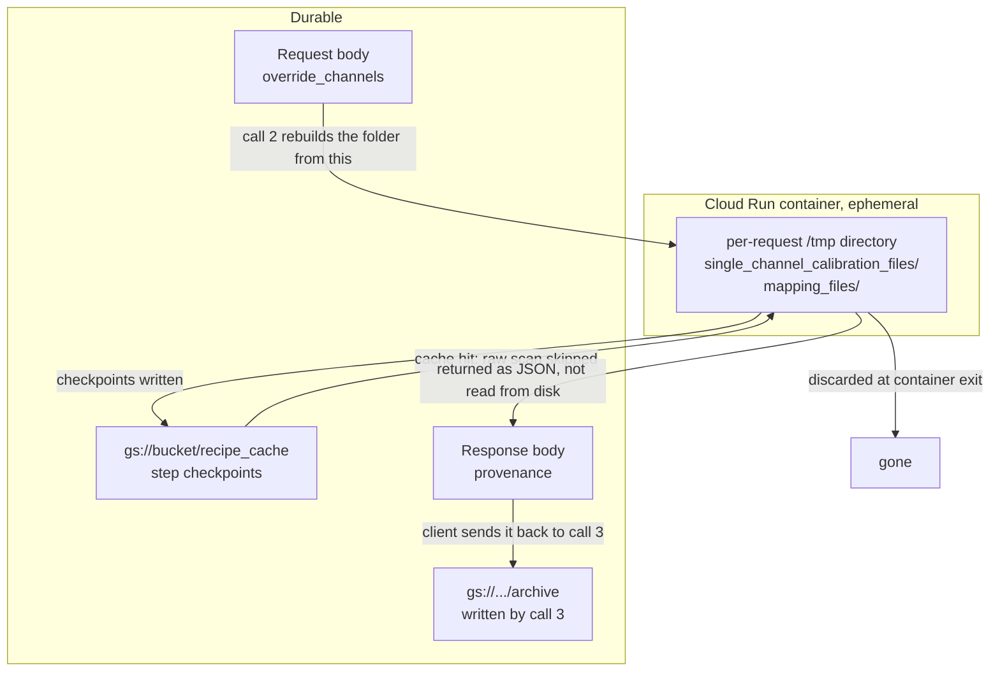

# Running the calibration service on Cloud Run

How to host the three calls in
[calibration_service_api.md](calibration_service_api.md) as Cloud Run HTTP
endpoints, each one invoking the recipe manager's `execute` function directly.

The design is deliberately thin. There is no per-operation HTTP surface and
there should not be: the recipe is what carries the caching, the provenance and
the step ordering, so a handler's whole job is to turn a JSON body into recipe
inputs and pick fields off the result.

## What survives a request, and what does not

This is the constraint the whole split exists to satisfy. A Cloud Run container
is ephemeral, so the calibration folder call 1 writes is gone before call 2
runs.



Three things persist: the GCS checkpoint cache, whatever the client sends, and
the archive call 3 writes. That is why the reviewed channels come back as
`override_channels` and call 2 rewrites the folder from them before mapping.

The same constraint shapes how the provenance report is returned. The mapping
step writes `mapping_files/calibration_provenance.yaml` inside the per-request
directory, so that file does not outlive the response. The step also returns the
identical content as a JSON-safe dict on its `provenance` output, and that is
what the handler puts in the body. `provenance_path` goes back too, but only as
something to quote in a log line; a client that tries to fetch it gets nothing.

Call 3 closes the loop. It takes the dictionaries the client is already holding
and writes them to a `gs://` prefix the caller names, which is the only point in
the flow where a file the survey keeps is written to durable storage. It reads
nothing, so it does not care that the folder from calls 1 and 2 is long gone.

## The handlers

```python
import uuid
from pathlib import Path

from aa_recipe_manager import api

RECIPES = Path("/app/recipes")                     # baked into the image
CACHE = "gs://your-bucket/recipe_cache"            # survives the container
ARCHIVE_ROOTS = ("gs://your-bucket/surveys/",)     # where clients may archive


def _run(recipe_name, inputs):
    """One recipe, one request. Isolated scratch per call."""
    work = Path("/tmp") / uuid.uuid4().hex
    return api.execute(
        RECIPES / recipe_name,
        inputs=inputs,
        user_cache_dir=CACHE,
        outputs_dir=work / "outputs",
        temp_dir=work / "exe_temp",
    )


def standardize(body):
    result = _run("calibration_standardize.yaml", _base_inputs(body))
    out = result.outputs["standardize_cal"]
    return {
        "single_channel_data": out["single_channel_data"],
        "single_channel_dir": out["single_channel_dir"],
    }


def mapping(body):
    inputs = _base_inputs(body)
    inputs["override_channels"] = body.get("override_channels")
    inputs["calibration_choices"] = body.get("calibration_choices") or {}
    inputs["conflict_resolution"] = "report"       # never interactive

    result = _run("calibration_mapping.yaml", inputs)
    out = result.outputs["build_cal_mapping"]
    return {
        "conflicts": out["conflicts"],
        "mapping_dict": out["mapping_dict"],
        "calibration_dict": out["calibration_dict"],
        # The report the client checks the mapping against. Return the dict,
        # not the path: the YAML it names is written inside this request's
        # scratch directory and is gone when the handler returns. It is
        # JSON-safe, so it goes straight into the response body.
        "provenance": out["provenance"],
        "provenance_path": out["provenance_path"],   # logs only
        # Required on both paths: when conflicts come back the mapping step
        # returns empty dictionaries, and this is the only place the client
        # can find the candidates' full records to compare them. Taken from
        # the mapping step, not standardize_cal, because it also carries any
        # record averaged from a list choice, which the archive call needs.
        "single_channel_data": out["single_channel_data"],
    }


def archive(body):
    # archive_dir is a path the client chose, so the service writes wherever it
    # is pointed. Constrain it to prefixes this deployment owns before running.
    archive_dir = body["archive_dir"]
    if not archive_dir.startswith(ARCHIVE_ROOTS):
        raise ValueError(f"archive_dir must be under one of {ARCHIVE_ROOTS}")

    result = _run("save_calibration.yaml", {
        "archive_dir": archive_dir,
        "overwrite": bool(body.get("overwrite", False)),
        # All three come straight back from the mapping response. Supplying
        # them is what lets this run in a container that never saw the folder
        # the earlier calls wrote.
        "mapping_dict": body["mapping_dict"],
        "provenance": body["provenance"],
        "single_channel_data": body["single_channel_data"],
    })
    return result.outputs["save_calibration"]       # already JSON-safe


def _base_inputs(body):
    keys = (
        "raw_input_folder", "cal_input_folder", "cruise_id",
        "record_author", "file_time_start", "file_time_end",
    )
    return {k: body[k] for k in keys if k in body}
```

## Configuration that matters

| Setting | Value | Why |
| --- | --- | --- |
| `user_cache_dir` | a `gs://` path | The only thing that survives the container. Calls 1 and 2 must point at the same path or call 2 re-scans every raw file. |
| `outputs_dir` | local, per request | Must be a local filesystem path; the artifact layer writes through `pathlib`. It must also be unique per request, see [Concurrency](#concurrency). |
| `temp_dir` | local, per request | Left unset it defaults to a sibling of `user_cache_dir`, which would put run scratch in the bucket. Set it explicitly. |
| `conflict_resolution` | `"report"` | Pin it server side. The recipe's own default is `"interactive"`, which blocks on a prompt nobody can answer. |
| `archive_dir` | a `gs://` prefix you own | Client-supplied, so validate it against an allowlist. See [The archive destination](#the-archive-destination). |
| Request timeout | 3600s | The platform maximum. The default is far lower (60s for a Cloud Run function, 300s for a service) and call 1 will exceed it. |
| CPU allocation | always allocated | Otherwise CPU is throttled outside request handling, which starves parallel workers. |
| Service account | `storage.objectAdmin` on the cache bucket and on every archive prefix | gcsfs picks up the ambient credentials, so `storage_options` stays `None`. |

### The archive destination

`archive_dir` is the one path in the API that names where the service writes,
and it comes from the client. Two things follow.

**Validate it.** The handler above checks it against a tuple of allowed
prefixes. Without that check, a caller can direct the service to write anywhere
its service account can reach. Nothing inside the archive step can make that
decision for you: it is the deployment that knows which buckets belong to it.

**Grant write access to it.** The archive is usually a different prefix from
`user_cache_dir`, and may be a different bucket. If the service account can
write the cache but not the archive, calls 1 and 2 succeed and call 3 fails on
the last step of the workflow.

Within the directory the client names, the step is already strict: it refuses a
non-empty `archive_dir` unless `overwrite` is set, and it rejects any calibration
file key that is not a plain file name, so a key cannot be used to escape the
prefix. See "What it refuses" in the API guide.

`outputs_dir` must stay local, but `archive_dir` is deliberately not subject to
that rule. The archive step renders its files to text and writes them through an
fsspec-aware helper, which is what lets it target a bucket while the rest of the
calibration artifacts stay on `pathlib`.

### Concurrency

Cloud Run sends many requests to one container by default (concurrency 80).
Nothing in the pipeline namespaces the outputs directory per run: the
calibration steps build their paths straight from `output_base`, so two requests
sharing a fixed `outputs_dir` share one `single_channel_calibration_files/`
folder.

That is not a benign race. Call 2 with `override_channels` **clears that folder**
before writing it, so one request can delete another's calibration files
mid-run.

Either give each request its own directory, as `_run` above does, or set
container concurrency to 1. The per-request directory is better: it keeps the
instance useful for more than one caller.

Call 3 is exempt when the client supplies all three data fields, since it then
reads nothing from the outputs folder, but there is no reason to special-case
it.

### /tmp is memory

Cloud Run's `/tmp` is a tmpfs, so anything written there counts against the
instance's memory limit rather than a disk quota. The calibration outputs are
small YAML files and will not trouble it, but size the instance with that in
mind and clean up the per-request directory when the handler returns.

## Sizing call 1

Call 1 scans every raw file in the window for its channel configuration. It does
not download them: `read_raw_file_config` reads a growing prefix, starting at 8
MiB and doubling to a 128 MiB cap, stopping as soon as every channel's Parameter
datagram is in hand. CW files settle on the first rung; large FM files climb.

For the parallel scan, pass a Dask executor:

```python
api.execute(
    RECIPES / "calibration_standardize.yaml",
    inputs=inputs,
    user_cache_dir=CACHE,
    outputs_dir=work / "outputs",
    temp_dir=work / "exe_temp",
    executor="dask",
    executor_options={"scheduler": "processes", "n_workers": 8},
)
```

Cloud Run allows up to 8 vCPU and 32 GiB per instance. Match `n_workers` to the
vCPU count. Running inside GCP also removes the cross-region bandwidth ceiling
that dominates the same scan from a workstation, so throughput should be better
there than in local benchmarking.

Calls 2 and 3 need none of this. With the scan cached, call 2 is a few small
local YAML reads and the matcher, and call 3 writes a dozen small files.

### The 60 minute ceiling

RL2307 is 5,763 raw files. At roughly a second per file with 8 workers, a full
survey scan is on the order of 10 to 15 minutes, which fits. But that estimate
is extrapolated from workstation measurements, the per-file cost varies with how
far the prefix scan has to climb, and 60 minutes is a hard platform maximum with
no recourse above it.

Three things keep that from being a risk worth redesigning around:

1. **A timeout loses no work.** `scan_raw_config` is `checkpoint: always` and
   content-addressed by file path, so every file already read is banked in the
   GCS cache. The same request sent again resumes and pays only for what is
   left.
2. **Only call 1 is exposed to it.** Calls 2 and 3 are comfortably inside any
   timeout.
3. **The window is a client input.** `file_time_start` and `file_time_end`
   narrow the file set, so a first call can be scoped to something that
   certainly finishes.

Have the client retry on timeout rather than treating it as an error. If a full
survey turns out not to fit even with retries, the escape hatch is to move call
1 to a Cloud Run Job, which has a 24 hour task limit; that costs an asynchronous
contract, since a Job has no HTTP endpoint and cannot return a response body, so
results would have to be polled and read from GCS.

## Cold starts

The image carries echopype, xarray and Dask, so it is large and cold starts are
slow. If a first request stalling for tens of seconds is a problem for the UI,
set minimum instances to 1 and accept the idle cost.
