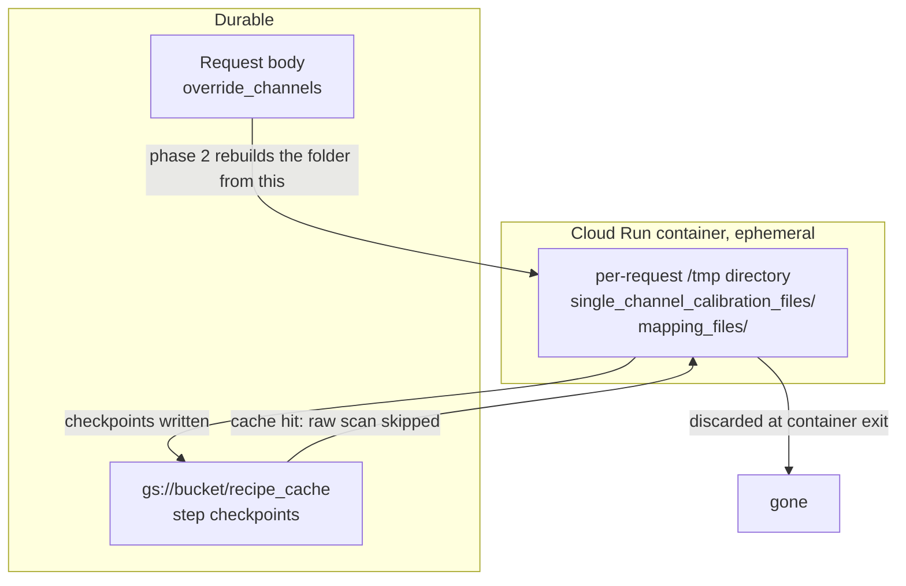

# Running the calibration service on Cloud Run

How to host the two calls in [calibration_service_api.md](calibration_service_api.md)
as Cloud Run HTTP endpoints, each one invoking the recipe manager's `execute`
function directly.

The design is deliberately thin. There is no per-operation HTTP surface and
there should not be: the recipe is what carries the caching, the provenance and
the step ordering, so a handler's whole job is to turn a JSON body into recipe
inputs and pick fields off the result.

## What survives a request, and what does not

This is the constraint the whole two-phase split exists to satisfy. A Cloud Run
container is ephemeral, so the calibration folder phase 1 writes is gone before
phase 2 runs.



Only two things persist: the GCS checkpoint cache, and whatever the client
sends. That is why the reviewed channels come back as `override_channels` and
phase 2 rewrites the folder from them before mapping. The archived NCEI files
therefore always match what was actually mapped, even though the disk they were
written to no longer exists.

## The handlers

```python
import uuid
from pathlib import Path

from aa_recipe_manager import api

RECIPES = Path("/app/recipes")                     # baked into the image
CACHE = "gs://your-bucket/recipe_cache"            # survives the container


def _run(recipe_name, inputs):
    """One recipe, one request. Isolated scratch per call."""
    work = Path("/tmp") / uuid.uuid4().hex
    return api.execute(
        RECIPES / recipe_name,
        inputs=inputs,
        user_cache_dir=CACHE,
        outputs_dir=work / "outputs",
        temp_dir=work / "exe_temp",
    )


def standardize(body):
    result = _run("calibration_standardize.yaml", _base_inputs(body))
    out = result.outputs["standardize_cal"]
    return {
        "single_channel_data": out["single_channel_data"],
        "single_channel_dir": out["single_channel_dir"],
    }


def mapping(body):
    inputs = _base_inputs(body)
    inputs["override_channels"] = body.get("override_channels")
    inputs["calibration_choices"] = body.get("calibration_choices") or {}
    inputs["conflict_resolution"] = "report"       # never interactive

    result = _run("calibration_mapping.yaml", inputs)
    out = result.outputs["build_cal_mapping"]
    return {
        "conflicts": out["conflicts"],
        "mapping_dict": out["mapping_dict"],
        "calibration_dict": out["calibration_dict"],
        # From standardize_cal, not the mapping step, and required on both
        # paths: when conflicts come back the mapping step returns empty
        # dictionaries, and this is the only place the client can find the
        # candidates' full records to compare them.
        "single_channel_data": (
            result.outputs["standardize_cal"]["single_channel_data"]
        ),
    }


def _base_inputs(body):
    keys = (
        "raw_input_folder", "cal_input_folder", "cruise_id",
        "record_author", "file_time_start", "file_time_end",
    )
    return {k: body[k] for k in keys if k in body}
```

## Configuration that matters

| Setting | Value | Why |
| --- | --- | --- |
| `user_cache_dir` | a `gs://` path | The only thing that survives the container. Both phases must point at the same path or phase 2 re-scans every raw file. |
| `outputs_dir` | local, per request | Must be a local filesystem path; the artifact layer writes through `pathlib`. It must also be unique per request, see [Concurrency](#concurrency). |
| `temp_dir` | local, per request | Left unset it defaults to a sibling of `user_cache_dir`, which would put run scratch in the bucket. Set it explicitly. |
| `conflict_resolution` | `"report"` | Pin it server side. `"interactive"` blocks on a prompt nobody can answer. |
| Request timeout | 3600s | The platform maximum. The default is far lower (60s for a Cloud Run function, 300s for a service) and phase 1 will exceed it. |
| CPU allocation | always allocated | Otherwise CPU is throttled outside request handling, which starves parallel workers. |
| Service account | `storage.objectAdmin` on the bucket | gcsfs picks up the ambient credentials, so `storage_options` stays `None`. |

### Concurrency

Cloud Run sends many requests to one container by default (concurrency 80).
Nothing in the pipeline namespaces the outputs directory per run: the
calibration steps build their paths straight from `output_base`, so two
requests sharing a fixed `outputs_dir` share one
`single_channel_calibration_files/` folder.

That is not a benign race. Phase 2 with `override_channels` **clears that
folder** before writing it, so one request can delete another's calibration
files mid-run.

Either give each request its own directory, as `_run` above does, or set
container concurrency to 1. The per-request directory is better: it keeps the
instance useful for more than one caller.

### /tmp is memory

Cloud Run's `/tmp` is a tmpfs, so anything written there counts against the
instance's memory limit rather than a disk quota. The calibration outputs are
small YAML files and will not trouble it, but size the instance with that in
mind and clean up the per-request directory when the handler returns.

## Sizing phase 1

Phase 1 scans every raw file in the window for its channel configuration. It
does not download them: `read_raw_file_config` reads a growing prefix, starting
at 8 MiB and doubling to a 128 MiB cap, stopping as soon as every channel's
Parameter datagram is in hand. CW files settle on the first rung; large FM
files climb.

For the parallel scan, pass a Dask executor:

```python
api.execute(
    RECIPES / "calibration_standardize.yaml",
    inputs=inputs,
    user_cache_dir=CACHE,
    outputs_dir=work / "outputs",
    temp_dir=work / "exe_temp",
    executor="dask",
    executor_options={"scheduler": "processes", "n_workers": 8},
)
```

Cloud Run allows up to 8 vCPU and 32 GiB per instance. Match `n_workers` to the
vCPU count. Running inside GCP also removes the cross-region bandwidth ceiling
that dominates the same scan from a workstation, so throughput should be better
there than in local benchmarking.

### The 60 minute ceiling

RL2307 is 5,763 raw files. At roughly a second per file with 8 workers, a full
survey scan is on the order of 10 to 15 minutes, which fits. But that estimate
is extrapolated from workstation measurements, the per-file cost varies with
how far the prefix scan has to climb, and 60 minutes is a hard platform
maximum with no recourse above it.

Three things keep that from being a risk worth redesigning around:

1. **A timeout loses no work.** `scan_raw_config` is `checkpoint: always` and
   content-addressed by file path, so every file already read is banked in the
   GCS cache. The same request sent again resumes and pays only for what is
   left.
2. **Phase 2 is cheap.** With the scan cached it is a few small local YAML
   reads and the matcher, comfortably inside any timeout.
3. **The window is a client input.** `file_time_start` and `file_time_end`
   narrow the file set, so a first call can be scoped to something that
   certainly finishes.

Have the client retry on timeout rather than treating it as an error. If a full
survey turns out not to fit even with retries, the escape hatch is to move
phase 1 to a Cloud Run Job, which has a 24 hour task limit; that costs an
asynchronous contract, since a Job has no HTTP endpoint and cannot return a
response body, so results would have to be polled and read from GCS.

## Cold starts

The image carries echopype, xarray and Dask, so it is large and cold starts are
slow. If a first request stalling for tens of seconds is a problem for the UI,
set minimum instances to 1 and accept the idle cost.
